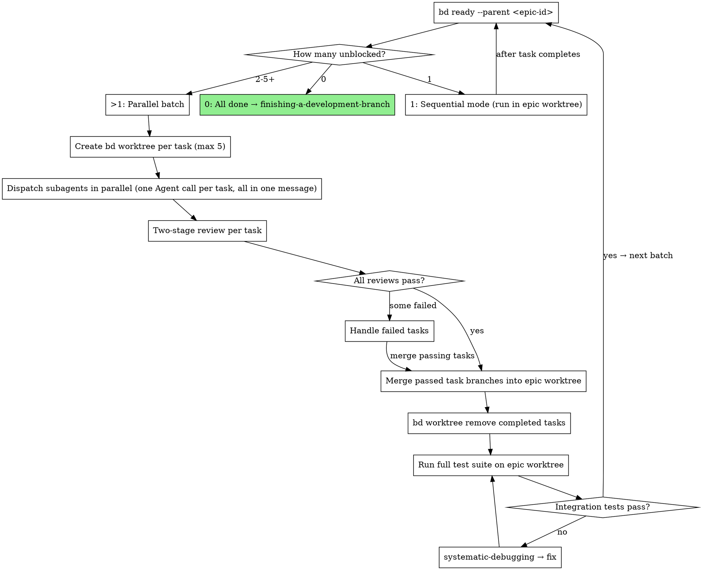

# SDD Parallel Worktree Isolation — Implementation Plan

> **For agentic workers:** REQUIRED SUB-SKILL: Use superpowers:subagent-driven-development (recommended) or superpowers:executing-plans to implement this plan task-by-task. Each Task becomes a bead (`bd create -t task --parent <epic-id>`). Steps within tasks use checkbox (`- [ ]`) syntax for human readability.

**Goal:** Add parallel batch mode with per-task worktree isolation to Subagent-Driven Development, generalize dispatching-parallel-agents beyond bug-fixing, and add multi-worktree documentation to using-git-worktrees.

**Architecture:** SDD gains dual-mode execution (sequential for dependent tasks, parallel batch for independent tasks). The orchestrator creates one `bd worktree` per independent task, dispatches up to 5 subagents in parallel, merges approved task branches into an epic worktree, and runs integration tests between batches. See [design spec](../specs/2026-05-02-sdd-parallel-worktree-isolation-design.md) and [ADR-0002](../../decisions/ADR-0002-sdd-parallel-worktree-architecture.md).

**Tech Stack:** Pure Markdown skill files. Validation via grep and `run-skill-tests.sh`.

**Beads:** Parent epic for plan execution should reference bd-8e6 (P0) and bd-0rd (P1). Brainstorming bead: bd-7v5.

---

## File Map

| File | Action | Responsibility |
|------|--------|---------------|
| `skills/subagent-driven-development/SKILL.md` | Modify | Add parallel batch mode section, update process preamble, update red flags, update integration |
| `skills/dispatching-parallel-agents/SKILL.md` | Modify | Generalize overview/when-to-use, add SDD integration section, add plan execution example |
| `skills/using-git-worktrees/SKILL.md` | Modify | Add multiple worktrees section, update quick reference table |

**Task dependency graph:**

```
Task 1 (SDD: parallel batch mode section)
  → Task 2 (SDD: update process preamble) [depends on Task 1]
  → Task 3 (SDD: update red flags) [depends on Task 1]
  → Task 4 (SDD: update integration section) [depends on Task 1]

Task 5 (dispatching-parallel-agents: generalize + SDD integration)
  [independent of Tasks 1-4]

Task 6 (using-git-worktrees: multi-worktree section)
  [independent of Tasks 1-5]

Task 7 (cross-file validation)
  [depends on ALL above]
```

Tasks 1-4 are sequential (same file, each builds on the prior).
Task 5 and Task 6 are independent of each other and of Tasks 1-4.
Task 7 depends on all.

---

### Task 1: SDD — Add Parallel Batch Mode Section

**Files:**
- Modify: `skills/subagent-driven-development/SKILL.md` (insert after line 89, which is the end of "The Process" section's `bd ready` note)

- [ ] **Step 1: Verify insertion point**

Run:
```bash
sed -n '87,91p' skills/subagent-driven-development/SKILL.md
```
Expected output includes: `**Checking for remaining tasks:**` and the `## Model Selection` heading.

- [ ] **Step 2: Insert the Parallel Batch Mode section**

Insert the following after line 89 (after `**Checking for remaining tasks:**...` paragraph, before `## Model Selection`):

````markdown

## Parallel Batch Mode

When `bd ready --parent <epic-id>` returns multiple unblocked tasks, those tasks have no dependencies between them and can execute in parallel — each in its own isolated `bd worktree`.

**Core principle:** One `bd worktree` per task + parallel dispatch = safe concurrency with per-task rollback.

**Parallel cap:** Maximum 5 subagents per batch. If more tasks are unblocked, split into batches of 5.

### Batch Execution Flow



### Parallel Batch Walkthrough

```
1. Orchestrator creates epic worktree (once, at the start):
     bd worktree create <epic-name>

2. Get unblocked tasks:
     bd ready --parent <epic-id>
     → Returns N tasks with no unresolved dependencies

3. If N > 1 (parallel batch, cap at 5 per batch):
   For each task in the batch:
     bd worktree create <task-name> --branch feature/<epic>/<task>

4. Dispatch all subagents in parallel:
   One Agent tool call per task, ALL in the same message:
     Agent({
       description: "Implement Task N: <name>",
       prompt: "<implementer-prompt with 'Work from: <task-worktree-path>'>",
       subagent_type: "implementer"
     })

5. Two-stage review per task (can also run in parallel):
   Spec compliance review → Code quality review

6. For each task that passes review:
     cd <epic-worktree-path>
     git merge feature/<epic>/<task>
     bd worktree remove <task-name>
     bd close <task-id> --reason "Completed: reviews passed"

7. Run full test suite on epic worktree (integration check):
   If fail → invoke systematic-debugging → fix before next batch

8. Re-run bd ready --parent <epic-id>
   Repeat from step 2 until no tasks remain

9. If N == 1 at any point:
   Sequential mode — run in epic worktree directly, no per-task worktree needed
```

### Failed Task Handling

When a parallel task fails review:

1. **Do not merge** its task branch into the epic branch.
2. **Option A — Re-dispatch:** Keep the task worktree. Re-dispatch a fix subagent with reviewer feedback. Re-review after fix.
3. **Option B — Discard:** `bd worktree remove <task-name>` discards the branch. Task bead stays open and will appear in the next `bd ready --parent` batch.
4. Other parallel tasks that passed review are still merged independently — one failure does not block the batch.

### Mode Selection

```
tasks = bd ready --parent <epic-id>

if len(tasks) == 0:
    All done → invoke finishing-a-development-branch
elif len(tasks) == 1:
    Sequential mode (run in epic worktree, existing behavior)
elif len(tasks) <= 5:
    Parallel batch (one bd worktree per task)
else:
    Take first 5 → parallel batch, remaining wait for next iteration
```

Mode selection is automatic. The orchestrator checks after every batch or sequential task completes.
````

- [ ] **Step 3: Verify the new section was inserted correctly**

Run:
```bash
grep -n "## Parallel Batch Mode" skills/subagent-driven-development/SKILL.md
grep -c "bd worktree create" skills/subagent-driven-development/SKILL.md
```
Expected: One match for the heading. At least 2 matches for `bd worktree create` (walkthrough + batch step).

- [ ] **Step 4: Commit**

```bash
git add skills/subagent-driven-development/SKILL.md
git commit -m "feat(sdd): add Parallel Batch Mode section with per-task worktree isolation (bd-8e6)"
```

---

### Task 2: SDD — Update Process Section Preamble

**Files:**
- Modify: `skills/subagent-driven-development/SKILL.md:42` (the `## The Process` heading)

- [ ] **Step 1: Verify current heading text**

Run:
```bash
sed -n '42p' skills/subagent-driven-development/SKILL.md
```
Expected: `## The Process`

- [ ] **Step 2: Add preamble after the heading**

Replace line 42's `## The Process` with:

```markdown
## The Process (Sequential Mode)

> This section describes **sequential execution** — one task at a time in a shared epic worktree. This is the default when tasks have dependencies or only one task is unblocked. For parallel execution of independent tasks, see **Parallel Batch Mode** below.
```

- [ ] **Step 3: Verify change**

Run:
```bash
grep -n "Sequential Mode" skills/subagent-driven-development/SKILL.md
grep "Parallel Batch Mode" skills/subagent-driven-development/SKILL.md | head -3
```
Expected: "Sequential Mode" appears in the process heading. "Parallel Batch Mode" appears in both the preamble cross-reference and the new section.

- [ ] **Step 4: Commit**

```bash
git add skills/subagent-driven-development/SKILL.md
git commit -m "refactor(sdd): rename The Process to Sequential Mode with parallel cross-reference (bd-8e6)"
```

---

### Task 3: SDD — Update Red Flags Section

**Files:**
- Modify: `skills/subagent-driven-development/SKILL.md` (Red Flags section, around line 243+)

- [ ] **Step 1: Verify current red flag to remove**

Run:
```bash
grep -n "Dispatch multiple implementation subagents in parallel" skills/subagent-driven-development/SKILL.md
```
Expected: One match at the Red Flags section.

- [ ] **Step 2: Remove the old parallel prohibition and add new red flags**

Replace this line:
```
- Dispatch multiple implementation subagents in parallel (conflicts)
```

With these three lines:
```
- Dispatch parallel subagents WITHOUT per-task worktree isolation (each subagent MUST have its own `bd worktree`)
- Dispatch more than 5 parallel subagents in a single batch (resource exhaustion)
- Use Claude's `isolation: "worktree"` parameter instead of `bd worktree` (bypasses beads DB sharing)
```

- [ ] **Step 3: Verify the change**

Run:
```bash
grep -c "Dispatch multiple implementation subagents in parallel" skills/subagent-driven-development/SKILL.md
grep "per-task worktree isolation" skills/subagent-driven-development/SKILL.md
grep "more than 5 parallel" skills/subagent-driven-development/SKILL.md
grep "isolation.*worktree.*parameter" skills/subagent-driven-development/SKILL.md
```
Expected: 0 matches for old text. 1 match each for the 3 new red flags.

- [ ] **Step 4: Commit**

```bash
git add skills/subagent-driven-development/SKILL.md
git commit -m "fix(sdd): replace parallel prohibition with per-task worktree requirement in Red Flags (bd-8e6)"
```

---

### Task 4: SDD — Update Integration Section

**Files:**
- Modify: `skills/subagent-driven-development/SKILL.md` (Integration section, around line 274+)

- [ ] **Step 1: Verify current integration section**

Run:
```bash
sed -n '274,287p' skills/subagent-driven-development/SKILL.md
```
Expected: `## Integration` followed by "Required workflow skills", "Subagents should use", and "Alternative workflow" subsections.

- [ ] **Step 2: Add new entries to the integration section**

After the existing `**Required workflow skills:**` entries (after the `finishing-a-development-branch` line), add:

```markdown
- **superpowers:dispatching-parallel-agents** - Parallel dispatch pattern (SDD uses the pattern, not the skill directly)
- **superpowers:receiving-code-review** - Review feedback loops in parallel review cycles
```

And after the existing `**Subagents should use:**` entry, update to:

```markdown
**Subagents should use:**
- **superpowers:test-driven-development** - Subagents follow TDD for each task

**Parallel mode uses:**
- **superpowers:using-git-worktrees** - Multiple worktrees for parallel task isolation
- **superpowers:systematic-debugging** - Integration test failures after batch merge
```

- [ ] **Step 3: Verify the changes**

Run:
```bash
grep "dispatching-parallel-agents" skills/subagent-driven-development/SKILL.md
grep "receiving-code-review" skills/subagent-driven-development/SKILL.md
grep "Parallel mode uses" skills/subagent-driven-development/SKILL.md
```
Expected: 1 match each.

- [ ] **Step 4: Commit**

```bash
git add skills/subagent-driven-development/SKILL.md
git commit -m "feat(sdd): add parallel mode skills to Integration section (bd-8e6)"
```

---

### Task 5: Generalize dispatching-parallel-agents + Add SDD Integration

**Files:**
- Modify: `skills/dispatching-parallel-agents/SKILL.md`

- [ ] **Step 1: Verify current overview text**

Run:
```bash
sed -n '8,14p' skills/dispatching-parallel-agents/SKILL.md
```
Expected: Overview section with "multiple unrelated failures" framing.

- [ ] **Step 2: Update the Overview paragraph**

Replace the second paragraph (line 12):
```
When you have multiple unrelated failures (different test files, different subsystems, different bugs), investigating them sequentially wastes time. Each investigation is independent and can happen in parallel.
```

With:
```
When you have multiple independent tasks — whether bug investigations, plan tasks, or subsystem changes — executing them sequentially wastes time. Each task is independent and can happen in parallel, provided each agent gets its own isolated workspace.
```

- [ ] **Step 3: Update the "When to Use" section**

After the existing `**Use when:**` list (which currently focuses on test failures), add these items to the list:

```markdown
- 2+ independent plan tasks with no dependency edges between them
- Multiple independent subsystem changes (different files, different concerns)
```

- [ ] **Step 4: Update the "When NOT to Use" section**

After the existing items in the `## When NOT to Use` section (line 126), add:

```markdown
**Single task:** Only one task remaining — no parallelism benefit
**Same files:** Tasks that modify the same files — merge conflicts likely even with worktree isolation
```

- [ ] **Step 5: Add the SDD Integration section**

Insert before `## Real Example from Session` (line 133). Add:

````markdown
## SDD Integration

Subagent-Driven Development uses this skill's **pattern** — not the skill itself — when executing plans with independent tasks.

**How SDD uses the pattern:**

1. SDD detects independent task batches via `bd ready --parent <epic-id>` (tasks with no unresolved dependencies)
2. Orchestrator creates one `bd worktree` per task — subagent receives path, never creates worktrees itself
3. Dispatches all implementer subagents in one message via multiple `Agent` tool calls (max 5 per batch)
4. SDD handles merge-back into the epic worktree after review

**Key difference from standalone use:** In SDD, the orchestrator manages the full lifecycle (worktree creation → dispatch → review → merge → cleanup). This skill describes the dispatch pattern; SDD adds the orchestration layer.

**Example — plan task execution with per-task worktrees:**

```
Orchestrator identifies 3 unblocked tasks (no deps between them):
  Task A: Add validation to user input (touches src/validation.py)
  Task B: Add logging middleware (touches src/middleware.py)
  Task C: Update API docs (touches docs/api.md)

Orchestrator creates per-task worktrees:
  bd worktree create task-a --branch feature/epic/task-a
  bd worktree create task-b --branch feature/epic/task-b
  bd worktree create task-c --branch feature/epic/task-c

Dispatches 3 subagents in parallel (one Agent call each, same message):
  Agent 1 → "Work from: .worktrees/task-a" → implements validation
  Agent 2 → "Work from: .worktrees/task-b" → implements middleware
  Agent 3 → "Work from: .worktrees/task-c" → updates docs

After all 3 pass review:
  git merge feature/epic/task-a (in epic worktree)
  git merge feature/epic/task-b
  git merge feature/epic/task-c
  bd worktree remove task-a task-b task-c
  Run full test suite → integration check
```
````

- [ ] **Step 6: Verify all changes**

Run:
```bash
grep "independent tasks" skills/dispatching-parallel-agents/SKILL.md
grep "## SDD Integration" skills/dispatching-parallel-agents/SKILL.md
grep "plan tasks" skills/dispatching-parallel-agents/SKILL.md
grep "Single task" skills/dispatching-parallel-agents/SKILL.md
grep "Same files" skills/dispatching-parallel-agents/SKILL.md
```
Expected: At least 1 match each.

- [ ] **Step 7: Commit**

```bash
git add skills/dispatching-parallel-agents/SKILL.md
git commit -m "feat(dispatching): generalize beyond bug-fixing, add SDD integration section (bd-8e6)"
```

---

### Task 6: Add Multiple Worktrees Section to using-git-worktrees

**Files:**
- Modify: `skills/using-git-worktrees/SKILL.md`

- [ ] **Step 1: Verify insertion point — before Quick Reference**

Run:
```bash
grep -n "## Quick Reference" skills/using-git-worktrees/SKILL.md
```
Expected: Line 174.

- [ ] **Step 2: Insert the Multiple Worktrees section**

Insert before `## Quick Reference` (line 174):

```markdown
## Multiple Worktrees for Parallel Subagents

When Subagent-Driven Development runs independent tasks in parallel, the **orchestrator** creates and manages multiple worktrees. Subagents never create or destroy worktrees — they receive a path and work within it.

**Pattern:**

```bash
# 1. Orchestrator creates epic worktree (once)
bd worktree create <epic-name>

# 2. For each parallel task (max 5 concurrent):
bd worktree create <task-name> --branch feature/<epic>/<task>

# 3. Subagent receives path in its prompt:
#    "Work from: <task-worktree-path>"

# 4. After task passes review — orchestrator merges and cleans up:
cd <epic-worktree-path>
git merge feature/<epic>/<task>
bd worktree remove <task-name>
```

**Constraints:**
- Maximum 5 concurrent task worktrees (resource limit)
- Orchestrator manages the full lifecycle — subagents never run `bd worktree` commands
- All task worktrees branch from the same HEAD commit (created before any subagent commits)
- After merge, run the full test suite on the epic worktree to catch integration issues

**See also:** `superpowers:subagent-driven-development` → Parallel Batch Mode section for the full orchestration flow.

```

- [ ] **Step 3: Add row to Quick Reference table**

Add this row to the Quick Reference table (after the last existing row `| No package.json/Cargo.toml | Skip dependency install |`):

```markdown
| Parallel subagent work | Create one `bd worktree` per task, orchestrator manages lifecycle (max 5) |
```

- [ ] **Step 4: Verify changes**

Run:
```bash
grep "## Multiple Worktrees" skills/using-git-worktrees/SKILL.md
grep "Parallel subagent work" skills/using-git-worktrees/SKILL.md
grep "max 5" skills/using-git-worktrees/SKILL.md
```
Expected: 1 match for section heading, 1 for quick reference row, at least 1 for max 5.

- [ ] **Step 5: Commit**

```bash
git add skills/using-git-worktrees/SKILL.md
git commit -m "feat(worktrees): add Multiple Worktrees for Parallel Subagents section (bd-8e6)"
```

---

### Task 7: Cross-File Validation

**Files:**
- Read-only: all 3 modified skill files

- [ ] **Step 1: Verify old parallel prohibition is gone**

Run:
```bash
grep -r "Dispatch multiple implementation subagents in parallel" skills/
```
Expected: 0 matches.

- [ ] **Step 2: Verify new content exists in all 3 files**

Run:
```bash
echo "=== SDD ===" && \
grep -c "Parallel Batch Mode" skills/subagent-driven-development/SKILL.md && \
grep -c "Sequential Mode" skills/subagent-driven-development/SKILL.md && \
grep -c "per-task worktree isolation" skills/subagent-driven-development/SKILL.md && \
echo "=== Dispatching ===" && \
grep -c "SDD Integration" skills/dispatching-parallel-agents/SKILL.md && \
grep -c "independent tasks" skills/dispatching-parallel-agents/SKILL.md && \
echo "=== Worktrees ===" && \
grep -c "Multiple Worktrees" skills/using-git-worktrees/SKILL.md && \
grep -c "Parallel subagent work" skills/using-git-worktrees/SKILL.md
```
Expected: All counts ≥ 1.

- [ ] **Step 3: Verify beads integration count hasn't dropped**

Run:
```bash
grep -r "bd create\|bd close\|bd ready\|bd worktree" skills/ | wc -l
```
Expected: ≥ 30 (was 30+ before changes; should increase with new bd worktree references).

- [ ] **Step 4: Verify cross-references resolve**

Run:
```bash
# SDD references dispatching-parallel-agents
grep "dispatching-parallel-agents" skills/subagent-driven-development/SKILL.md

# SDD references using-git-worktrees
grep "using-git-worktrees" skills/subagent-driven-development/SKILL.md

# Dispatching references SDD
grep -i "subagent-driven-development\|SDD" skills/dispatching-parallel-agents/SKILL.md

# Worktrees references SDD
grep -i "subagent-driven-development\|SDD" skills/using-git-worktrees/SKILL.md
```
Expected: At least 1 match per check.

- [ ] **Step 5: Run existing skill tests if available**

Run:
```bash
cd tests/claude-code && bash run-skill-tests.sh 2>&1 | tail -20
```
Expected: Tests pass (or note any pre-existing failures).

- [ ] **Step 6: No commit needed** — this task is validation only. If issues found, fix them and commit the fix.
