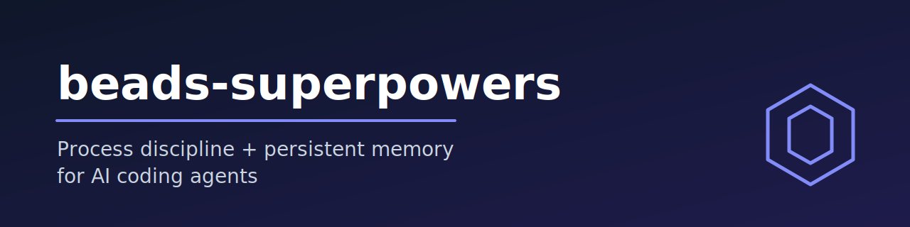
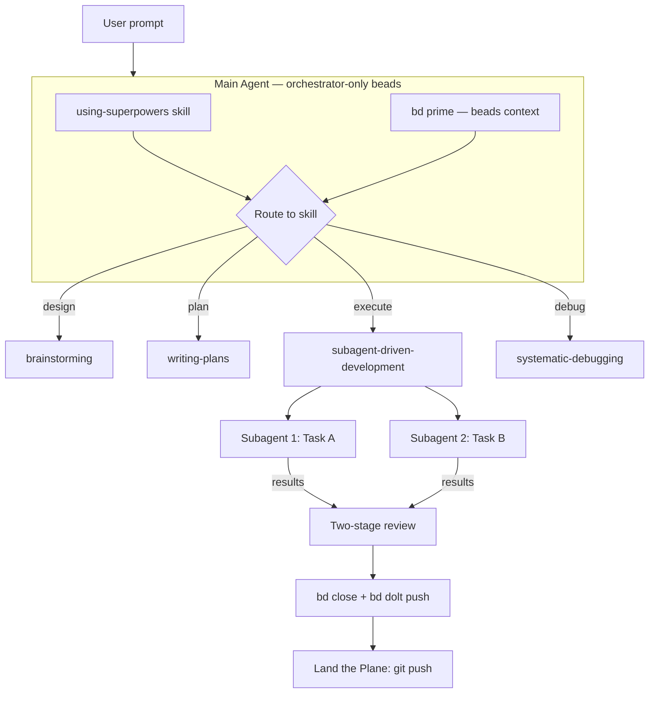

<p align="center">
  
</p>

<p align="center">
  <em>Process discipline and persistent memory for AI coding agents.</em>
</p>

<p align="center">
  <a href="LICENSE"></a>
  <a href=".claude-plugin/plugin.json"></a>
  <a href="https://github.com/DollarDill/beads-superpowers/actions/workflows/ci.yml"></a>
  <a href="https://github.com/DollarDill/beads-superpowers/stargazers"></a>
</p>

---

## Try it in 60 seconds

### Option A: Claude Code Marketplace (recommended)

```bash
claude plugin marketplace add DollarDill/beads-superpowers
claude plugin install beads-superpowers@beads-superpowers-marketplace
```

### Option B: npx (via Vercel Skills CLI)

```bash
npx skills add DollarDill/beads-superpowers --all -y
```

> **Note:** The npx method installs skills only (no hooks or agents). For the full plugin experience including SessionStart hooks and `bd prime` injection, use the marketplace method.

### Then, in any project

```bash
cd your-project
bd init
```

In Claude Code, run `/skills` and you should see 15+ skills prefixed with `beads-superpowers:`.

<details>
<summary>If you previously ran <code>bd setup claude</code></summary>

The plugin's SessionStart hook already runs `bd prime`. Remove the duplicate hooks:

```bash
bd setup claude --remove
```

</details>

## Why it exists

AI coding agents have two recurring failure modes:

1. **No process discipline.** They skip tests, rush to code, and claim work is done without verification.
2. **No persistent memory.** Todo lists vanish when a session ends. The next session starts blind.

**beads-superpowers** merges two upstream systems to solve both at once:

- **[Superpowers](https://github.com/obra/superpowers)** by Jesse Vincent — 15 mandatory skills enforcing TDD, brainstorming, systematic debugging, and two-stage code review.
- **[Beads](https://github.com/gastownhall/beads)** by Steve Yegge — a Dolt-backed issue tracker that survives across sessions, agents, and projects.

The result: skills that don't just tell agents *how* to work — they give agents a persistent ledger to track *what* they're working on.

## How it works

```text
Session Start
  │
  ▼
SessionStart hook fires automatically
  ├── Injects using-superpowers skill (skill routing + beads awareness)
  └── Runs bd prime (beads CLI context + persistent memories)
  │
  ▼
Agent receives task from user
  │
  ▼
Skill system activates
  ├── brainstorming → design spec → user approval
  ├── writing-plans → implementation plan → beads created for each task
  ├── subagent-driven-development → execute tasks → two-stage review
  │     └── Per task: bd create → bd update --claim → implement → bd close
  └── finishing-a-development-branch → merge/PR → Land the Plane
  │
  ▼
Land the Plane (mandatory session close)
  ├── bd close <completed-beads> --reason "description"
  ├── bd dolt push (sync beads to Dolt remote)
  ├── git push (sync code to remote)
  └── git status (verify clean state)
```

The `using-superpowers` skill (loaded at every session start) enforces:

> **IF A SKILL APPLIES TO YOUR TASK, YOU DO NOT HAVE A CHOICE. YOU MUST USE IT.**

Skills are not suggestions. They use bright-line rules, anti-rationalization tables, and empirically-tested enforcement language. See [`docs/METHODOLOGY.md`](docs/METHODOLOGY.md) for the research basis.

## Skills reference

| Skill | Category | When to use |
|-------|----------|-------------|
| **using-superpowers** | Meta | Every session start — routes to the right skill |
| **brainstorming** | Design | Before any creative work — explores design before code |
| **writing-plans** | Planning | After design approval — creates bite-sized task plans |
| **subagent-driven-development** | Execution | Execute plans with fresh subagent per task + two-stage review |
| **executing-plans** | Execution | Execute plans in a single session with checkpoints |
| **test-driven-development** | Quality | Any feature or bugfix — RED-GREEN-REFACTOR cycle |
| **systematic-debugging** | Quality | Any bug or test failure — 4-phase root cause analysis |
| **verification-before-completion** | Quality | Before any "done" claim — evidence before assertions |
| **requesting-code-review** | Review | After implementation — dispatches code reviewer |
| **receiving-code-review** | Review | When receiving feedback — anti-sycophancy review reception |
| **using-git-worktrees** | Infrastructure | Isolated development branches with safety checks |
| **finishing-a-development-branch** | Infrastructure | Merge/PR decision tree + Land the Plane protocol |
| **dispatching-parallel-agents** | Advanced | 2+ independent tasks without shared state |
| **writing-skills** | Meta | Creating or modifying skills — TDD for process docs |
| **auditing-upstream-drift** | Meta | Periodic audit for staleness vs upstream superpowers and beads |

### Beads commands used in skills

| Action | Command | Used in |
|--------|---------|---------|
| Create epic | `bd create "Epic: name" -t epic` | subagent-driven-dev, executing-plans |
| Create task | `bd create "Task: name" -t task --parent <epic>` | subagent-driven-dev, executing-plans |
| Claim work | `bd update <id> --claim` | executing-plans |
| Complete work | `bd close <id> --reason "description"` | all execution skills |
| Check remaining | `bd ready --parent <epic>` | subagent-driven-dev, executing-plans |
| Add dependency | `bd dep add <child> <parent>` | subagent-driven-dev, writing-plans |
| Store learning | `bd remember "insight"` | any session |
| Sync to remote | `bd dolt push` | finishing-a-development-branch |
| Session context | `bd prime` | SessionStart hook (automatic) |

## Architecture



The orchestrator is the only agent that touches beads. Subagents focus on implementation and have no concurrent bead-conflict surface. The two-stage review catches both spec deviation (first-stage spec reviewer) and code-quality issues (second-stage code reviewer) before any task is marked complete.

## Design decisions

| Decision | Rationale |
|----------|-----------|
| **Orchestrator-only beads** | Only the main agent manages beads. Subagents focus on implementation — no concurrent bead conflicts. |
| **Plugin subsumes bd hooks** | The plugin's SessionStart hook runs `bd prime` itself. No need for separate `bd setup claude` hooks. |
| **TodoWrite fully replaced** | Every TodoWrite reference is replaced with `bd` commands. Zero active TodoWrite usage. |
| **Land the Plane in finishing skill** | Session close protocol lives in the terminal skill, not a separate skill. Every pipeline path ends here. |
| **Skills are Markdown, not code** | Pure documentation — no build step, no dependencies, works on any platform with a file system. |

## Project structure

```text
beads-superpowers/
├── .claude-plugin/         Plugin manifests (auto-discovered by Claude Code)
├── .github/                CI workflow, Dependabot, issue/PR templates
├── assets/                 README banner SVG
├── hooks/                  SessionStart hook (bash + Windows polyglot wrapper)
├── skills/                 15 beads-native skills
├── agents/                 code-reviewer agent
├── commands/               Deprecated slash commands (will be removed in v0.2.0)
├── docs/                   METHODOLOGY, SETUP-GUIDE, testing, upstream-reference
├── tests/                  Test infrastructure (5 suites)
├── scripts/                bump-version.sh
├── CHANGELOG.md
├── CLAUDE.md               Plugin development instructions
├── AGENTS.md               Agent instructions
├── CONTRIBUTING.md         How to contribute
├── SECURITY.md             Vulnerability reporting policy
├── LICENSE                 MIT
└── README.md               This file
```

For a deeper directory listing, see [`docs/SETUP-GUIDE.md`](docs/SETUP-GUIDE.md).

## Development

When you edit skills in this repo, the installed plugin cache goes stale. The simplest fix is a one-time symlink:

```bash
rm -rf ~/.claude/plugins/cache/beads-superpowers-marketplace/beads-superpowers/0.1.1
ln -s ~/workplace/beads-superpowers \
  ~/.claude/plugins/cache/beads-superpowers-marketplace/beads-superpowers/0.1.1
```

Verify sync:

```bash
diff -rq skills/ ~/.claude/plugins/cache/beads-superpowers-marketplace/beads-superpowers/0.1.1/skills/
```

> `claude plugin update` exists but has a [cache invalidation bug](https://github.com/anthropics/claude-code/issues/14061). Use the symlink approach instead.

For the full contributor guide, see [`CONTRIBUTING.md`](CONTRIBUTING.md).

## Attribution

- **Superpowers skills** — [obra/superpowers](https://github.com/obra/superpowers) by Jesse Vincent (MIT License)
- **Beads issue tracker** — [gastownhall/beads](https://github.com/gastownhall/beads) by Steve Yegge (MIT License)
- **beads-superpowers integration** — Dillon Frawley

## License

[MIT](LICENSE)
