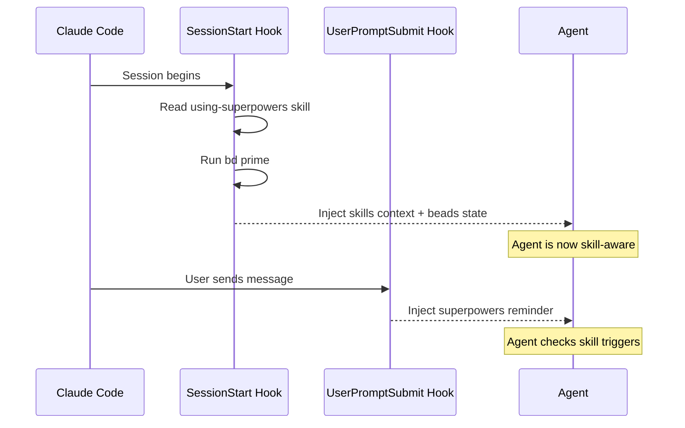

# Getting Started

Install and configure beads-superpowers in 60 seconds.

## Prerequisites

You need two things before installing the plugin:

1. **Claude Code** — Install from [claude.ai/claude-code](https://claude.ai/claude-code)
2. **Beads (`bd` CLI)** — The task tracking backend the plugin depends on

### Install the `bd` CLI

Choose the method that fits your platform. The `bd` CLI is maintained at [gastownhall/beads](https://github.com/gastownhall/beads).

**Homebrew (macOS / Linux):**

```
brew install beads
```

**npm (any platform):**

```
npm install -g @beads/bd
```

**curl installer:**

```
curl -fsSL https://raw.githubusercontent.com/gastownhall/beads/main/scripts/install.sh | bash
```

Verify the install:

```
bd version
```

### Optional dependencies

- **Git** — Required for the Land the Plane protocol (`git push`)
- **Dolt remote** — Required for `bd dolt push/pull` (cross-session sync). Sign up at [dolthub.com](https://dolthub.com)

## Installation

Three methods are available. The curl installer is the simplest — it requires only `bash` and works without Claude Code's plugin system.

### Option A: curl (recommended)

One command, no dependencies. Installs {{ skill_count }} skills to `~/.claude/skills/` and configures the SessionStart hook automatically.

```
curl -fsSL https://raw.githubusercontent.com/DollarDill/beads-superpowers/main/install.sh | bash
```

The installer supports additional flags: `--yes` (CI mode, skip prompts), `--version X.Y.Z` (pin a version), `--dry-run` (preview without writing), and `--uninstall`.

### Option B: Claude Code Marketplace

Two commands using the Claude Code plugin system:

```
claude plugin marketplace add DollarDill/beads-superpowers
claude plugin install beads-superpowers@beads-superpowers-marketplace
```

You can also run these as slash commands inside an active Claude Code session:

```
/plugin marketplace add DollarDill/beads-superpowers
/plugin install beads-superpowers@beads-superpowers-marketplace
```

### Option C: npx (via Vercel Skills CLI)

Install skills via the Vercel Skills CLI:

```
npx skills add DollarDill/beads-superpowers --all -y -g
```

After installing, tell Claude: **"Run the setup skill"** — this configures the SessionStart hook that makes skills activate automatically on every session start.

## First Project Setup

After installing the plugin, initialise beads in your project directory:

```
cd your-project
bd init
```

This creates:

- `.beads/` directory containing config, metadata, and git hooks
- `CLAUDE.md` with beads instructions (superseded by the plugin's context injection)
- `AGENTS.md` with agent instructions (also superseded by the plugin)

> **Warning**
>
> `bd init` installs Claude Code hooks that run `bd prime` on SessionStart. The beads-superpowers plugin's SessionStart hook **also** runs `bd prime`. Having both causes redundant context injection (~2x token overhead).
>
> Remove the duplicate hooks immediately after running `bd init`:
>
> ```
> bd setup claude --remove
> ```

### Set up Dolt remote (optional but recommended)

For cross-session persistence of your task history:

```
# Create a DoltHub account at dolthub.com, then:
bd dolt remote add origin https://doltremoteapi.dolthub.com/your-org/your-repo

# Test the connection
bd dolt push
```

## Verify Installation

Start a new Claude Code session. The SessionStart hook injects the `using-superpowers` skill context and runs `bd prime` automatically.

Run these commands to confirm everything is working:

**1. Check the plugin is installed and enabled:**

```
claude plugin list

# Expected output:
#   > beads-superpowers@beads-superpowers-marketplace
#     Version: {{ version }}
#     Scope: user
#     Status: enabled
```

**2. Verify skills are available (inside a Claude Code session):**

```
/skills
# Should list {{ skill_count }} beads-superpowers: prefixed skills
```

**3. Verify `bd` is working:**

```
bd ready
bd stats
```

> **Tip**
>
> The `/skills` command is a slash command run inside Claude Code — not a shell command. Open a Claude Code session in your project directory and type it directly.

## Configuration

### How the hook mechanism works

The plugin registers two hooks via `hooks/hooks.json`. The `SessionStart` hook fires on every session start, clear, and compact event. The hook script:

1. Reads `using-superpowers/SKILL.md` — the bootstrap skill that routes to all other skills
2. Runs `bd prime` — captures beads workflow context and persistent memories
3. Checks for duplicate hooks — warns if `bd setup claude` hooks are still installed
4. Outputs platform-specific JSON for Claude Code, Cursor, or Copilot CLI

The combined output (~2–3k tokens) provides the agent with skill routing instructions, beads awareness, and anti-rationalization enforcement.

#### UserPromptSubmit hook

The plugin also registers a **UserPromptSubmit** hook that fires on every user message. It injects a tiered reminder covering all 20 invocable skills — the top 12 get explicit trigger mappings (bug → systematic-debugging, new feature → brainstorming, research question → research-driven-development, etc.) and the remaining 7 are listed as "also available." This prevents the agent from forgetting to invoke skills mid-session.



### Duplicate hook warning

If you have previously run `bd setup claude` (or `bd init`, which calls it), the plugin detects the overlap and displays a warning at session start. To resolve it:

```
bd setup claude --remove

# Verify removal — should NOT contain "bd prime" entries
cat .claude/settings.json
```

### Plugin cache symlink for development

If you are contributing to the plugin or testing local skill edits, the installed cache at `~/.claude/plugins/cache/` goes stale after every edit. Symlink it to your working copy once:

```
rm -rf ~/.claude/plugins/cache/beads-superpowers-marketplace/beads-superpowers/0.5.1
ln -s ~/workplace/beads-superpowers \
  ~/.claude/plugins/cache/beads-superpowers-marketplace/beads-superpowers/0.5.1
```

After symlinking, edits to skills take effect immediately in every new session — no reinstall needed.

### Beads project configuration

Beads is configured per-project in `.beads/config.yaml`. The defaults work for most projects; the main knobs are:

```
# Issue ID prefix (default: directory name)
# issue:
#   prefix: my-project

# Dolt auto-commit policy
# dolt:
#   auto-commit: on|off|batch
```

### Instruction priority

When instructions conflict, the resolution order is:

1. **Your project's `CLAUDE.md`** — highest priority
2. **Plugin skills** — override default Claude behaviour
3. **Default system prompt** — lowest priority

To override a skill's behaviour for your project, add instructions to your project's `CLAUDE.md` — you do not need to fork the plugin.

## Troubleshooting

### Skills not loading

Verify the plugin is installed and recognised:

```
/plugins          # In Claude Code — should list beads-superpowers
/skills           # Should show beads-superpowers: prefixed skills
```

If the plugin does not appear, try reinstalling:

```
claude plugin marketplace update beads-superpowers-marketplace
claude plugin update beads-superpowers@beads-superpowers-marketplace
```

### `bd`: command not found

> **Warning**
>
> Beads is not installed, or it is not on your `PATH`. Install it and verify:
>
> ```
> brew install beads
> # or
> npm install -g @beads/bd
>
> bd version
> ```

### No `.beads` directory found

You need to initialise beads in your project first:

```
cd your-project
bd init
```

Remember to remove duplicate hooks afterwards (see the [First Project Setup](#first-project-setup) section above).

### Duplicate context injection (double `bd prime`)

> **Warning**
>
> If you see beads context injected twice at session start, the plugin's hook and `bd setup claude` hooks are both active. Remove the standalone hooks:
>
> ```
> bd setup claude --remove
> ```

### Plugin cache is stale after editing skills

The installed cache does not update when you edit skill files. Use the symlink approach described in the [Configuration](#configuration) section, or reinstall the plugin:

```
claude plugin update beads-superpowers@beads-superpowers-marketplace
```

> **Warning**
>
> `claude plugin update` has a known [cache bug](https://github.com/anthropics/claude-code/issues/14061). If the update does not pick up your changes, use the symlink approach instead.

### Hook not firing

Check that the hook script is executable:

```
ls -la hooks/session-start
# Should show -rwxr-xr-x

# If not:
chmod +x hooks/session-start
```

### `bd dolt push` fails

You need a Dolt remote configured first:

```
bd dolt remote add origin <url>
```

If you do not need remote sync, the push failure is harmless — beads continues to work locally with full functionality.
