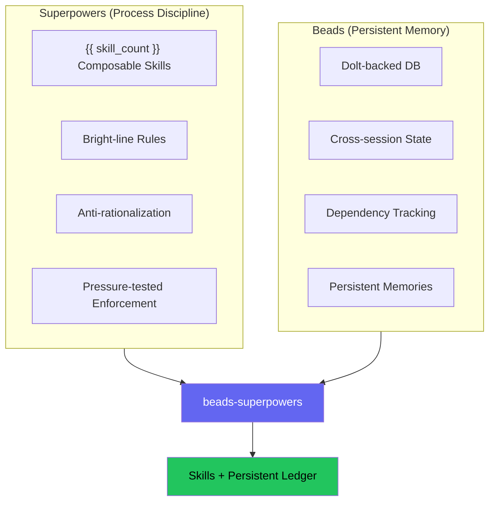
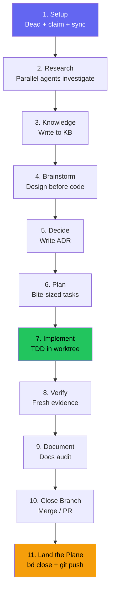

# Methodology

Why beads-superpowers exists, how it works, and what research shaped the design.

## The Problem

Ask an AI coding agent to build a feature and watch what happens. It skips straight to code, writes implementation before tests, claims the work is "done" without running verification, and if you point out a problem it agrees instantly rather than pushing back. When you start a new session the next day, every task it was tracking has vanished. Two separate projects attacked each half of this problem.

### Process Discipline

[Superpowers](https://github.com/obra/superpowers) (Jesse Vincent) shipped 14 composable skills that force agents to brainstorm before coding, write tests before implementation, investigate root causes before proposing fixes, and verify before claiming completion. The skills use bright-line rules ("NO PRODUCTION CODE WITHOUT A FAILING TEST FIRST") rather than hedged guidance ("consider writing tests"), because compliance doubles from 33% to 72% when instructions are absolute rather than suggested (Meincke et al. 2025). Each skill includes an anti-rationalization table that preempts the excuses agents use to skip process steps.

### Persistent Memory

Superpowers tracked tasks with `TodoWrite`, which vanishes when a session ends. [Beads](https://github.com/gastownhall/beads) (Steve Yegge) replaced that with a Dolt-backed issue tracker where every task is a bead with a hash-based ID that survives session boundaries. Beads handles dependency tracking, cell-level merges for conflict-free multi-agent work, a full audit trail via the events table, and `bd remember` for persistent learnings. At every session start, `bd prime` injects the current task state so the agent picks up where it left off.

### The Gap

Superpowers enforced good process but forgot everything between sessions. Beads remembered everything but imposed no process on how work should be done. beads-superpowers connects the two: every process step in every skill now creates, updates, or closes a persistent bead, so following the right process and maintaining persistent memory are the same action.

## How It Works

The plugin installs {{ skill_count }} composable skills and a Dolt-backed task database. A `using-superpowers` bootstrap skill loads at session start and routes the agent to whichever skill fits the current task. The Dolt database stores every bead (task) with hash-based IDs, dependency chains, and an events table that records what happened and when.



## The Integration

The first change was mechanical: every `TodoWrite` call across the original 14 Superpowers skills was replaced with the equivalent `bd` command. The result is that following process discipline and populating persistent memory are the same action. Subsequent changes went deeper — restructuring how subagents are dispatched, adding parallel execution, and introducing dynamic configuration.

| Before (TodoWrite) | After (Beads) |
|--------------------|---------------|
| `TodoWrite("Task 1: Implement login")` | `bd create "Task 1: Implement login" -t task --parent <epic-id>` |
| Mark task as in_progress | `bd update <task-id> --claim` |
| Mark task as completed | `bd close <task-id> --reason "Implemented login"` |
| "More tasks remain?" | `bd ready --parent <epic-id>` |
| Create todo per checklist item | `bd create "Step: title" -t chore --parent <session-id>` |

The replacement operates at two levels. At the task level, execution skills track plan tasks as beads. At the checklist level, skills like brainstorming (9 steps) and writing-skills (20 steps) create a bead for each internal step. Both levels are persistent and auditable, because if checklist-level tracking is ephemeral while task-level tracking is persistent, agents learn that some tracking is optional.

### Orchestrator-Only Design

Only the orchestrating agent creates, claims, and closes beads. Subagents focus on their specific job. This prevents concurrent write conflicts and keeps subagent prompts simple: orchestrator creates bead, dispatches subagent, subagent does the work, orchestrator closes bead.

The one exception is `implementer-prompt.md`, which is beads-aware by design. It includes bead lifecycle commands (`bd update --claim`, `bd close --reason`), mandatory skill invocations (TDD, systematic-debugging, verification-before-completion), and LSP-first code navigation. Review subagent prompts (spec-reviewer, code-quality-reviewer) remain deliberately unaware of beads.

### What Was Added

Beyond the `TodoWrite` replacement, the integration added several structural pieces:

**Session lifecycle.** The `using-superpowers` skill gained a Beads Issue Tracking section so every session starts with beads awareness. The `finishing-a-development-branch` skill gained the Land the Plane protocol (`bd dolt push` + `git push`) so every session ends with both task state and code synced to remote. The `verification-before-completion` skill requires evidence in `bd close` because closing a bead without evidence is treated the same as not verifying.

**Dependency tracking.** Execution skills use an epic/child bead pattern with `bd dep add` for dependency tracking, and brainstorming beads link forward to plan epics via `discovered-from` so the design trail is connected to the implementation trail.

**Prompt template pattern.** Subagent definitions moved from standalone agent files into prompt templates owned by the skills that dispatch them (`implementer-prompt.md`, `researcher-prompt.md`, `spec-reviewer-prompt.md`, `code-quality-reviewer-prompt.md`). This eliminates drift between the skill's expectations and the subagent's instructions — a single source of truth per subagent role.

**Parallel batch mode.** The `subagent-driven-development` skill gained a parallel execution mode: when `bd ready --parent` returns multiple unblocked tasks, they execute concurrently (max 5 per batch), each in its own `bd worktree`. The `dispatching-parallel-agents` skill was generalized from bug-fixing to any independent parallel work.

**Dynamic Context Injection (DCI).** The `research-driven-development` skill uses Claude Code's `!` backtick syntax to resolve the research output directory at skill load time, with a three-tier priority: per-project config, environment variable, or `./docs/research` default.

**Mid-session enforcement.** A `UserPromptSubmit` hook fires on every user message, injecting a tiered skill trigger reminder that prevents the agent from forgetting to invoke skills as the session progresses.

## What Was Preserved

The integration was additive. All 14 original Superpowers skills kept their complete content: every anti-rationalization table, Iron Law, Red Flags section, the progressive skill chain (brainstorming, plans, execution, finishing), the two-stage review pattern (spec compliance then code quality), all three subagent prompt templates, and the platform reference files for Gemini, Copilot CLI, and Codex.

Since the fork, the project has grown from 14 to {{ skill_count }} skills. The eight additions are `auditing-upstream-drift`, `document-release`, `getting-up-to-speed`, `project-init`, `setup`, `stress-test`, `write-documentation`, and `research-driven-development`.

## Design Decisions

### Plugin Subsumes Beads Hooks

Beads' `bd setup claude` command installs SessionStart hooks that run `bd prime`. The plugin's SessionStart hook also needs to inject the `using-superpowers` skill content. Having both fire would inject 3-4k tokens of partially redundant context, so the plugin's `hooks/session-start` script does both: it injects `using-superpowers` and runs `bd prime` itself. It also detects if the `bd setup claude` hooks are still installed and warns the user to remove them.

### Land the Plane in the Terminal Skill

The session close protocol lives in `finishing-a-development-branch` (Step 6) rather than a separate `session-close` skill or the user's CLAUDE.md. Both `subagent-driven-development` and `executing-plans` already end by invoking this skill, so every pipeline path passes through the mandatory push ritual without needing a separate dependency.

### Skills Are Markdown, Not Code

Following Superpowers' zero-dependency philosophy, all skills are plain Markdown files with YAML frontmatter. No build step, no runtime dependencies. The plugin works on any platform with a file system, skills can be read and modified by humans, and the only runtime dependency is `bd` (beads CLI), which is optional — skills still work without it, they just lose persistence.

## Agent Memory Types

Because beads tracks every process step, the seven memory types agents need are populated as a side effect of following the workflow rather than requiring separate bookkeeping.

| Memory Type | Beads Feature | Purpose |
|-------------|---------------|---------|
| **Working** | `bd show --current` | What am I doing right now? |
| **Short-term** | `bd list --status=in_progress` | What's active? |
| **Long-term** | `bd remember` + `bd prime` | Persistent learnings across sessions |
| **Procedural** | `bd formula` | Reusable workflow templates |
| **Episodic** | `events` table | Complete audit trail of what happened |
| **Semantic** | `bd search`, `bd query` | Find related work by meaning |
| **Prospective** | `bd ready` | What should I do next? |

## Research Basis

The enforcement language in skills draws on two lines of research, plus one empirical finding from the project itself.

### Cialdini (2021) — Influence Principles

Three principles from *Influence: The Psychology of Persuasion* (New and Expanded Edition) shape how skills are written. Authority: Iron Laws use absolute phrasing ("NO PRODUCTION CODE WITHOUT A FAILING TEST FIRST") because agents treat authoritative instructions as harder to override. Consistency: once an agent begins following a skill's process, consistency pressure keeps it on track through the remaining steps. Scarcity: phrasing like "you cannot rationalize your way out of this" removes the sense that alternatives exist.

### Meincke et al. (2025) — Compliance with Absolute vs. Hedged Instructions

This study found that compliance doubled from 33% to 72% when AI agents received absolute rules instead of hedged guidance, that pre-emptive rationalization counters outperformed reactive correction, and that specific examples of non-compliance were more effective than generic warnings. These findings explain the structure of every discipline-enforcing skill: an Iron Law (absolute, memorable, no exceptions), a Red Flags table (anticipated rationalizations with pre-loaded counter-arguments), and bright-line rules (MUST/NEVER rather than "consider" or "prefer").

### TDD Applied Recursively

The `writing-skills` meta-skill revealed that TDD principles apply to process documentation itself:

| TDD Concept | Skill Creation Equivalent |
|-------------|--------------------------|
| Test case | Pressure scenario with subagent |
| Production code | Skill document (SKILL.md) |
| Test fails (RED) | Agent violates rule without skill (baseline) |
| Test passes (GREEN) | Agent complies with skill present |
| Refactor | Close loopholes while maintaining compliance |

Every rule in every skill has been verified through adversarial pressure testing, not designed from theory alone.

### Claude Search Optimization (CSO)

An empirical finding from the `writing-skills` meta-skill: when a skill's YAML `description` field summarized the workflow ("code review between tasks"), Claude followed the description instead of reading the full skill content and did one review instead of the two the skill specified. As a result, every skill's `description` field is now a trigger condition ("when to use this") rather than a workflow summary ("what this does"), which forces the full skill content to be read.

## End-to-End Workflow

Here is a non-trivial feature request moving through the full 11-state FSM, from session start to the next session picking up where the first left off. Simple tasks skip the research and planning phases (S2–S6) but still pass through the quality pipeline (S7–S11).



### Step 1 — Setup

Every task begins with a bead. Before a single line of research or code happens, the work is captured as a tracked item (`bd create`), claimed by the agent (`bd update <id> --claim`), and the remote state is synced. If the session ends unexpectedly, the bead record shows an in-progress item that can be recovered.

### Step 2 — Deep Research

For non-trivial tasks, the `research-driven-development` skill dispatches two agents in parallel: a researcher subagent (via `researcher-prompt.md`) investigates the problem domain, and an `@explore` agent maps the affected code and traces dependencies. Running both concurrently cuts research time roughly in half.

### Step 3 — Knowledge Capture

Research findings are synthesized into a durable knowledge base document. The output directory is resolved by the research skill's DCI resolver with a three-tier priority: per-project config, environment variable, or `./docs/research` default. Key learnings are persisted with `bd remember "insight"` so they surface in future sessions.

### Step 4 — Brainstorming

The `brainstorming` skill uses a Socratic approach to explore the solution space. It creates a session bead and child beads for each checklist step, then walks through project context, clarifying questions, 2–3 approaches with trade-offs, and a design spec committed to git. The terminal state is invoking `writing-plans`, not jumping to code. The `stress-test` skill may fire during this phase to adversarially interrogate the design.

### Step 5 — Decision Capture

Architecture decisions are recorded as ADRs (Architecture Decision Records) in `docs/decisions/`. This transforms the implicit decisions made during brainstorming into explicit, timestamped records with context, rationale, and consequences.

### Step 6 — Writing Plans

`writing-plans` breaks the approved design into bite-sized tasks (2–5 minutes each) with exact file paths, code snippets, and verification steps. Every task becomes a bead. The plan is saved to `docs/` and handed to `subagent-driven-development`.

### Step 7 — Implementation

Code runs in an isolated git worktree. The orchestrator creates an epic bead with task children and dependency chains:

```bash
bd create "Epic: Auth System" -t epic
bd create "Task 1-5" -t task --parent <epic-id>
bd dep add <child> <depends-on>
```

For each task, the orchestrator dispatches an implementer subagent (via `implementer-prompt.md` with `subagent_type: "general-purpose"`) that works under TDD (red-green-refactor). When multiple tasks are unblocked, parallel batch mode executes up to 5 subagents concurrently, each in its own per-task worktree. After each task, a spec reviewer and code quality reviewer run in sequence. Only after both pass does the orchestrator close the bead.

### Step 8 — Verification

The `verification-before-completion` skill runs the full test suite independently — not relying on the last test run during development. Claims of correctness must be backed by fresh evidence. "Tests pass" means a test command was just run and its output is attached.

### Step 9 — Documentation

The `document-release` skill scans the diff against existing documentation to identify stale references, missing entries, and outdated examples. Documentation gaps caught here are cheaper to fix than gaps discovered by users.

### Step 10 — Close Branch

`finishing-a-development-branch` verifies tests pass (hard gate), determines the base branch, presents four options (merge locally, create PR, keep the branch, or discard), executes the chosen option, and cleans up the worktree.

### Step 11 — Land the Plane

```bash
bd close <epic-id> --reason "All tasks complete"
bd dolt push
git pull --rebase && git push
git status
```

Work is not done until both `bd dolt push` (task state) and `git push` (code) succeed. `git status` must show "up to date with origin" before the agent stops. The next session runs `bd prime` to restore the full picture.

## What This Enables

**For individual developers:** Cross-session continuity via `bd prime`, process discipline without needing to remind the agent, and a full audit trail of every task, review, and close reason in the beads ledger.

**For teams:** Shared project state via `bd dolt push/pull`, concurrent multi-agent work via hash-based IDs and cell-level merge, and convention persistence via `bd remember` (injected into every future session for every agent).

**For the ecosystem:** A reference implementation that fully merges workflow skills with persistent issue tracking. MIT licensed, extensible, and the pattern is documented.

## Sources

### Systems

- [obra/superpowers](https://github.com/obra/superpowers) v5.0.7 — 14 composable skills for AI agents (MIT)
- [gastownhall/beads](https://github.com/gastownhall/beads) v1.0.2 — Persistent issue tracker for AI agents (MIT)

### Research

- Cialdini, R. B. (2021). *Influence: The Psychology of Persuasion* (New and Expanded Edition). Harper Business.
- Meincke, L., et al. (2025). Research on AI agent compliance with explicit vs hedged instructions. Referenced in `skills/writing-skills/persuasion-principles.md`.
- Anthropic best practices for skill authoring. Referenced in `skills/writing-skills/anthropic-best-practices.md`.

### Analysis Documentation

Design documents and implementation plans from the overhaul are available in `docs/beads-superpowers/`:

- `specs/` — Design specs from brainstorming (SDD parallel mode, example workflow, write-documentation, single source of truth)
- `plans/` — Implementation plans from writing-plans

Architecture decisions are recorded in `docs/decisions/` as ADRs.
