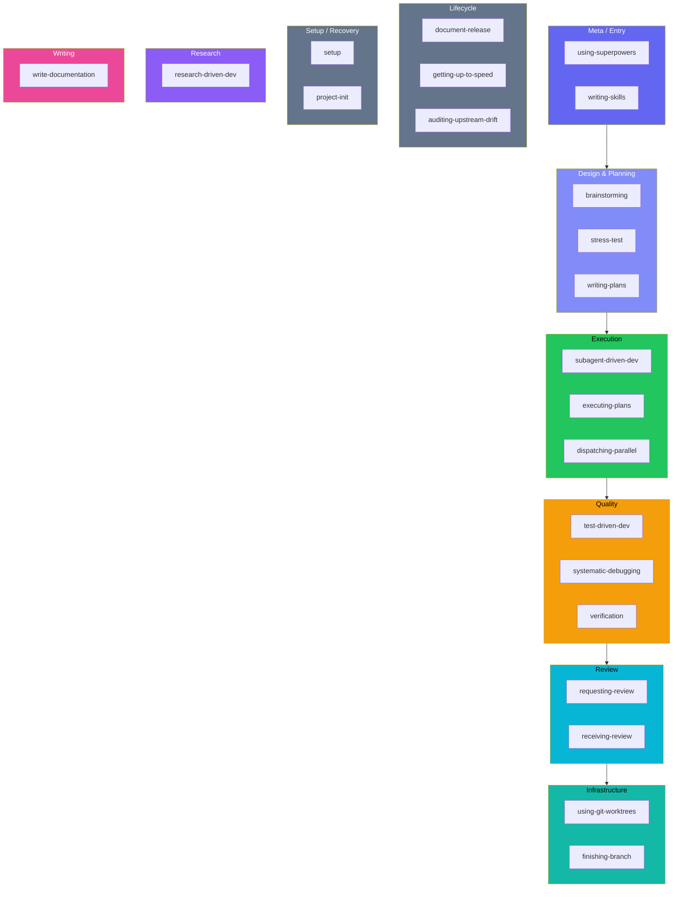
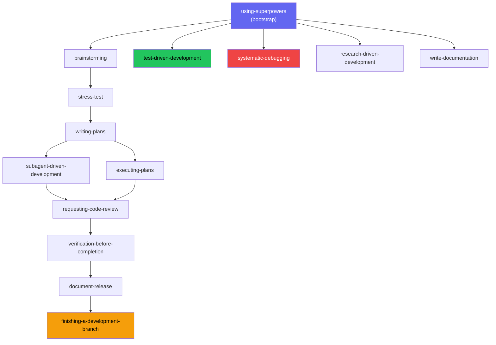

# Skills Reference

Complete reference for all {{ skill_count }} beads-superpowers skills

## Overview

beads-superpowers ships {{ skill_count }} composable skills that are loaded on demand via the `Skill` tool.
The bootstrap skill, **using-superpowers**, is injected at every session start and routes
automatically to the correct skill for the current task.

Skills are **mandatory enforcement mechanisms**, not suggestions. When a skill applies to
your task, the plugin's using-superpowers bootstrap states explicitly:

> IF A SKILL APPLIES TO YOUR TASK, YOU DO NOT HAVE A CHOICE. YOU MUST USE IT.

Each skill uses bright-line rules, anti-rationalization tables, and empirically-tested enforcement
language. See the [Methodology](methodology.md) page for the research basis behind this design.

### How skills get triggered

Two hooks work together to ensure skills are never forgotten:

- **SessionStart hook** — fires once at session start (and after `/clear` or `/compact`). Injects the `using-superpowers` bootstrap skill and runs `bd prime` for beads context.
- **UserPromptSubmit hook** — fires on *every* user message. Injects a tiered reminder covering all {{ invocable_count }} invocable skills (all {{ skill_count }} total minus `using-superpowers`, which auto-loads at session start). The top 14 high-frequency skills get explicit trigger mappings (across 13 rows, with SDD and executing-plans sharing one); the remaining 7 are listed as "also available":

| If the task involves... | The reminder points to... |
|---|---|
| Bug or test failure | `systematic-debugging` |
| Writing code | `test-driven-development` |
| New feature or design | `brainstorming` |
| Challenge or stress-test a design | `stress-test` |
| Writing a plan | `writing-plans` |
| Executing a plan | `subagent-driven-development` or `executing-plans` |
| Research question | `research-driven-development` |
| Complex task (6+ files) | `using-git-worktrees` |
| About to claim done | `verification-before-completion` |
| Code review needed | `requesting-code-review` |
| Received review feedback | `receiving-code-review` |
| Writing human-facing prose | `write-documentation` |
| Branch complete | `finishing-a-development-branch` |

**Also available:**
`document-release`,
`getting-up-to-speed`,
`dispatching-parallel-agents`,
`project-init`,
`setup`,
`writing-skills`,
`auditing-upstream-drift`

This two-layer approach means the agent gets full skill context at session start, then a lightweight
nudge on every subsequent message to check whether a skill applies. The nudge prevents mid-session
drift — even after many turns, the agent is reminded to invoke skills rather than skipping them.

## Skills by Category

| Category | Skills |
|---|---|
| **Meta / Entry** | [using-superpowers](#using-superpowers), [writing-skills](#writing-skills) |
| **Design & Planning** | [brainstorming](#brainstorming), [writing-plans](#writing-plans), [stress-test](#stress-test) |
| **Execution** | [subagent-driven-development](#subagent-driven-development), [executing-plans](#executing-plans), [dispatching-parallel-agents](#dispatching-parallel-agents) |
| **Quality** | [test-driven-development](#test-driven-development), [systematic-debugging](#systematic-debugging), [verification-before-completion](#verification-before-completion) |
| **Review** | [requesting-code-review](#requesting-code-review), [receiving-code-review](#receiving-code-review) |
| **Infrastructure** | [using-git-worktrees](#using-git-worktrees), [finishing-a-development-branch](#finishing-a-development-branch) |
| **Lifecycle** | [document-release](#document-release), [getting-up-to-speed](#getting-up-to-speed), [auditing-upstream-drift](#auditing-upstream-drift) |
| **Setup / Recovery** | [setup](#setup), [project-init](#project-init) |
| **Research** | [research-driven-development](#research-driven-development) |
| **Writing** | [write-documentation](#write-documentation) |

## All Skills

### using-superpowers

**Category:** Meta / Entry

**Trigger:** Use when starting any conversation — establishes how to find and use skills, requiring Skill tool invocation before ANY response including clarifying questions.

The bootstrap skill injected at every session start. It establishes the skill invocation protocol and
routes the agent to the correct skill for the current task. All other skills depend on this one
having been loaded first.

### writing-skills

**Category:** Meta / Entry

**Trigger:** Use when creating new skills, editing existing skills, or verifying skills work before deployment.

The meta-skill for managing the skill library itself. Enforces TDD-for-process-docs: new skills must
have a failing test before the SKILL.md is written, and the frontmatter description must be a trigger
condition, not a workflow summary.

### brainstorming

**Category:** Design & Planning

**Trigger:** You MUST use this before any creative work — creating features, building components, adding functionality, or modifying behavior. Explores user intent, requirements and design before implementation.

Socratic design exploration before any code is written. The agent asks structured questions to surface
requirements, constraints, and design alternatives. Each brainstorming session produces beads capturing
the agreed design direction.

### writing-plans

**Category:** Design & Planning

**Trigger:** Use when you have a spec or requirements for a multi-step task, before touching code.

Translates a design or spec into a bite-sized, phase-by-phase implementation plan where every task
becomes a bead. Plans include acceptance criteria, dependency ordering, and an explicit verification
step per phase so the implementer can verify before proceeding.

### stress-test

**Category:** Design & Planning

**Trigger:** Use when a design, plan, or decision needs adversarial scrutiny before proceeding. Interrogates every branch of the decision tree, providing recommended answers and forcing explicit agreement or pushback. Triggers on "grill me", "stress test this", "poke holes", "challenge this design", or when brainstorming/writing-plans suggests review.

Adversarial interrogation of a design or plan with recommended answers for each challenge. Forces the
author to either accept or explicitly reject each critique. Typically runs after brainstorming and
before writing-plans in the design pipeline.

### subagent-driven-development

**Category:** Execution

**Trigger:** Use when executing implementation plans with independent tasks in the current session.

Dispatches a fresh subagent per task from a written plan, with two-stage code review between tasks.
The orchestrating agent tracks beads; subagents are not permitted to touch beads directly. Each task
lands with a review checkpoint before the next task is started. When multiple tasks are unblocked,
**parallel batch mode** executes up to 5 subagents concurrently, each in its own per-task worktree.

### executing-plans

**Category:** Execution

**Trigger:** Use when you have a written implementation plan to execute in a separate session with review checkpoints.

Executes a multi-phase plan in a single session with explicit checkpoints between phases. Each phase
is claimed, implemented, verified against acceptance criteria, and closed before the next phase begins.
Designed to complement written-plans output directly.

### dispatching-parallel-agents

**Category:** Execution

**Trigger:** Use when facing 2+ independent tasks that can be worked on without shared state or sequential dependencies.

Coordinates multiple concurrent subagents for independent parallel work — plan tasks, subsystem
changes, or any set of changes without shared state. Enforces strict isolation — agents must not
share mutable state or touch the same files. Results are collected and merged by the orchestrator
after all agents complete. Also used by SDD's parallel batch mode for the dispatch pattern.

### test-driven-development

**Category:** Quality

**Trigger:** Use when implementing any feature or bugfix, before writing implementation code.

Enforces the RED-GREEN-REFACTOR cycle as an Iron Law: no implementation code may be written until a
failing test exists. The skill prevents bypassing the red phase by requiring explicit evidence of the
failing test output before any production code is touched.

### systematic-debugging

**Category:** Quality

**Trigger:** Use when encountering any bug, test failure, or unexpected behavior, before proposing fixes.

Four-phase root cause analysis: observe, hypothesize, isolate, fix. Prevents premature fixes by
requiring a confirmed root cause before any code change is proposed. Anti-rationalization table
blocks common shortcuts like "just try this and see".

### verification-before-completion

**Category:** Quality

**Trigger:** Use when about to claim work is complete, fixed, or passing, before committing or creating PRs — requires running verification commands and confirming output before making any success claims; evidence before assertions always.

Mandatory evidence collection before any "done" claim. The agent must run verification commands and
show the actual output — not assert from memory — before closing a bead or creating a PR. Prevents
hallucinated test results.

### requesting-code-review

**Category:** Review

**Trigger:** Use when completing tasks, implementing major features, or before merging to verify work meets requirements.

Dispatches a dedicated code reviewer subagent after implementation is complete. The reviewer runs two
stages: spec compliance first, then code quality. The reviewing agent is given the original
requirements alongside the diff so it can check both correctness and cleanliness.

### receiving-code-review

**Category:** Review

**Trigger:** Use when receiving code review feedback, before implementing suggestions, especially if feedback seems unclear or technically questionable — requires technical rigor and verification, not performative agreement or blind implementation.

Anti-sycophancy protocol for receiving review feedback. Requires the implementer to evaluate each
suggestion technically rather than accepting blindly to avoid conflict. Escalates disagreements
explicitly rather than silently ignoring or silently complying.

### using-git-worktrees

**Category:** Infrastructure

**Trigger:** Use when starting feature work that needs isolation from current workspace or before executing implementation plans — creates isolated git worktrees with smart directory selection and safety verification.

Creates and manages isolated git worktrees for feature work using `bd worktree` commands. Includes
safety checks, smart directory selection, and teardown instructions. Supports **multiple concurrent
worktrees** for parallel subagent work — the orchestrator creates one `bd worktree` per task (max 5)
and manages the full lifecycle.

### finishing-a-development-branch

**Category:** Infrastructure

**Trigger:** Use when implementation is complete, all tests pass, and you need to decide how to integrate the work — guides completion of development work by presenting structured options for merge, PR, or cleanup.

Structured decision tree for integrating a completed branch: direct merge vs. PR, squash vs. rebase,
and the mandatory "Land the Plane" sequence: `bd close` completed beads, `bd dolt push`
to sync, then `git push` to remote. Ensures nothing is left half-open.

### document-release

**Category:** Lifecycle

**Trigger:** Use after code changes are committed but before PR merge to ensure all project documentation accurately reflects shipped code. Covers README, ARCHITECTURE, CONTRIBUTING, CHANGELOG, CLAUDE.md, TODOS, and VERSION files.

Post-ship documentation audit that walks through every documentation file to find and fix drift
between docs and the shipped code. Checks README, CHANGELOG, CLAUDE.md, ARCHITECTURE, CONTRIBUTING,
and VERSION files against the actual state of the codebase.

### getting-up-to-speed

**Category:** Lifecycle

**Trigger:** Use at the start of a session, after compaction, or whenever you need to orient on an unfamiliar or stale codebase. Loads beads context, deep-dives the codebase, and produces a structured current-state summary. Triggers on phrases like "catch me up", "where are we", "orient me", "what's the state of this project".

Session orientation workflow: runs `bd prime` to load beads context, performs an adaptive
deep-dive of the codebase based on what has changed recently, and produces a structured current-state
summary so work can continue without re-reading everything from scratch.

### auditing-upstream-drift

**Category:** Lifecycle

**Trigger:** Use when checking if beads-superpowers is outdated, before a plugin release, or when auditing for missing capabilities — covers upstream drift, test execution, documentation, plugin health, and content integrity.

Periodic audit against the upstream sources ([obra/superpowers](https://github.com/obra/superpowers)
and [gastownhall/beads](https://github.com/gastownhall/beads)) to detect new skills, changed
commands, and documentation improvements that should be ported into this fork.

### setup

**Category:** Setup / Recovery

**Trigger:** Use after installing beads-superpowers skills via npx to configure the SessionStart hook that makes skills auto-activate. Also use when skills are installed but not triggering automatically, or when the user says "set up beads-superpowers", "configure hooks", or "skills aren't activating".

Post-installation configuration: registers the SessionStart hook in `.claude/settings.json`
so that `using-superpowers` and `bd prime` fire automatically at the start of
every session. Also detects and removes duplicate hooks if `bd setup claude` was run separately.

### project-init

**Category:** Setup / Recovery

**Trigger:** Use when beads/Dolt database initialization fails, when bd commands return errors about missing databases, when setting up beads in a new project, or when recovering from diverged Dolt history. Handles fresh init, bootstrap from remote, and recovery workflows.

Three-path workflow for beads/Dolt database management: fresh initialization in a new project,
bootstrap from an existing remote when the local DB is missing, and recovery when Dolt history has
diverged and needs a hard reset. Prevents data loss by confirming the correct path before executing.

### research-driven-development

**Category:** Research

**Trigger:** Use when the user asks a question about a topic, requests research, or when you need to understand something before planning. Dispatches parallel research agents, synthesizes findings into a persistent document.

Dispatches a researcher subagent (via `researcher-prompt.md` with `subagent_type: "general-purpose"`)
and `@explore` (codebase) in parallel, then synthesizes their findings into a structured research
document. The output directory is resolved at skill load time via DCI, with a configurable three-tier
priority: per-project config, environment variable, or `./docs/research` default.
Iron Law: NO RESEARCH WITHOUT A DOCUMENT — verbal answers without persistent artifacts are prohibited.

### write-documentation

**Category:** Writing

**Trigger:** Use when writing or substantially rewriting human-facing prose: documentation, README, guides, blog posts, emails, Slack messages, PR descriptions, release notes, or any text a human will read.

Adapts the [WRITING.md](https://github.com/Anbeeld/WRITING.md) 14-rule writing system
for AI-generated prose. Uses a context-first drafting workflow: identify medium and audience, draft
with rules internalized, run required checks as a revision pass, cut genericity, and present.
Targets the specific patterns that make LLM prose recognizable (regularity, catalog prose,
service-desk tone, false crispness) without faking humanity. Pairs with
`document-release` (which handles *when* to update docs, not *how* to write them).

## Beads Commands

Skills use `bd` commands to create, track, and close beads (tasks). Only the orchestrating
agent manages beads — subagents do not touch them directly.

| Action | Command | Used In |
|---|---|---|
| Create epic | `bd create "Epic: name" -t epic` | subagent-driven-development, executing-plans |
| Create task | `bd create "Task: name" -t task --parent <epic>` | subagent-driven-development, executing-plans |
| Quick capture | `bd q "title"` | any skill |
| Claim work | `bd update <id> --claim` | executing-plans |
| Complete work | `bd close <id> --reason "description"` | all execution skills |
| Check remaining | `bd ready --parent <epic>` | subagent-driven-development, executing-plans |
| Add dependency | `bd dep add <child> <parent>` | subagent-driven-development, writing-plans |
| Store learning | `bd remember "insight"` | any session |
| Remove stale memory | `bd forget <id>` | any session |
| Append note to bead | `bd note <id> "context"` | verification-before-completion |
| Find duplicate beads | `bd find-duplicates` | finishing-a-development-branch |
| Sync to remote | `bd dolt push` | finishing-a-development-branch |
| Session context | `bd prime` | SessionStart hook (automatic) |

## How Skills Chain Together

The **using-superpowers** skill is the entry point loaded by the SessionStart hook at
every session. It establishes the invocation protocol and determines which skill (if any) applies
to the current task. From there, skills chain naturally through a typical development workflow:

1. **brainstorming** — explore design and requirements before any code
2. **stress-test** — adversarially interrogate the design
3. **writing-plans** — produce a beads-backed implementation plan
4. **subagent-driven-development** or **executing-plans** — execute the plan
5. **test-driven-development** — RED-GREEN-REFACTOR inside each task
6. **requesting-code-review** — two-stage review after implementation
7. **verification-before-completion** — evidence before any "done" claim
8. **document-release** — sync docs to match shipped code
9. **finishing-a-development-branch** — merge decision tree + Land the Plane

Skills like **systematic-debugging** and **verification-before-completion**
fire whenever their trigger condition is met regardless of where in the workflow the session is.
Skills are not optional stages — they are mandatory enforcement gates.

!!! info "Mandatory enforcement"
    The using-superpowers skill states: *"IF A SKILL APPLIES TO YOUR TASK, YOU DO NOT HAVE A CHOICE.
    YOU MUST USE IT."* This is not a suggestion. The enforcement language in each skill is intentionally
    prescriptive to prevent rationalization.
