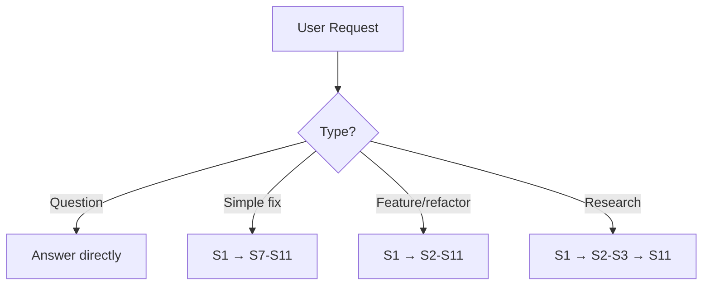
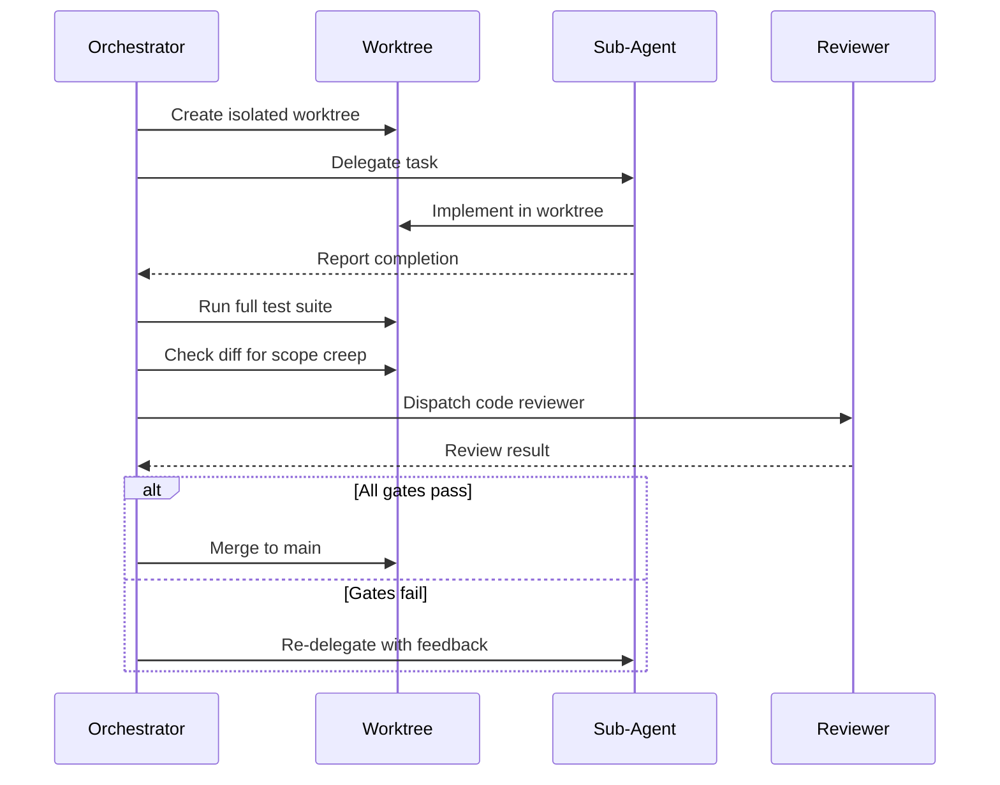

# Example Workflow

How beads-superpowers skills orchestrate a complete professional development lifecycle.

!!! tip "Ready to use this workflow?"
    We provide a complete, copy-paste-ready configuration bundle with the CLAUDE.md and orchestrator agent pre-configured for this workflow.

    [Get the CLAUDE.md + Agent Config](https://github.com/DollarDill/beads-superpowers/tree/main/example-workflow){ .md-button }

    Contains: [CLAUDE.md](https://github.com/DollarDill/beads-superpowers/blob/main/example-workflow/CLAUDE.md) · [yegge.md](https://github.com/DollarDill/beads-superpowers/blob/main/example-workflow/agents/yegge.md) (orchestrator agent)

    Subagents (researcher, implementer, code-reviewer) are dispatched via prompt templates within their skills — no standalone agent files needed.

## Overview

beads-superpowers skills orchestrate a complete professional development lifecycle through an 11-state finite state machine. Every code change follows a disciplined path from research through verification. The FSM is not a suggestion — each state transition has an explicit guard condition that must be satisfied before moving forward.

The machine enforces two key principles simultaneously: every non-trivial task invests in research and planning before a line of code is written, and every code change — no matter how small — passes through the same quality pipeline before landing.

The first six states (S1–S6) scale with complexity: a simple one-line fix skips research and planning entirely, going straight from S1 to the quality pipeline. A major feature or architectural change invests fully in all six stages. The last five states (S7–S11) are mandatory for every code change.

## Request Triage

Before entering the FSM, every incoming request is classified. The classification determines which states are visited — it does not skip the quality pipeline (S7–S11), which always runs.

| Request Type | Examples | Path |
|---|---|---|
| Quick question | "What does this file do?" | Answer directly — no FSM |
| Simple task | "Fix this typo", "Update a constant" | S1 → S7 → S8 → S9 → S10 → S11 |
| Non-trivial task | "Add a new feature", "Refactor this module" | S1 → S2 → S3 → S4 → S5 → S6 → S7 → S8 → S9 → S10 → S11 |
| Research query | "How does X work?", "What are our options for Y?" | S1 → S2 → S3 → S11 |

!!! info "Routing Principle"
    "Every task that changes code gets the quality pipeline (S7–S11). Complexity scales the research and planning depth (S2–S6), not the quality gates."

**Quick questions** bypass the FSM entirely — they are conversational responses that produce no artifacts and carry no state. **Simple tasks** skip the research and design phases but still go through the full implementation quality pipeline; the assumption is that the problem is already understood and the solution is obvious. **Non-trivial tasks** run the full machine: the research and planning investment prevents rework and scope creep later. **Research queries** produce a knowledge artifact (S3) and then land without implementing anything.

## The Development Lifecycle

Each state has a defined entry action, a guard condition that must be satisfied before transitioning out, and a failure path. States are not skipped and are not left with a partial guard — if a guard cannot be satisfied, the failure path is taken before proceeding.

### S1 — Setup

Every task begins with a bead. Before a single line of research or code happens, the work is captured as a tracked item, claimed by the agent, and the remote state is synced. This ensures there is no orphaned work — if the session ends unexpectedly, the bead record shows an in-progress item that can be recovered in the next session.

- **Action:** Create bead (`bd create "task title"`), claim it (`bd update <id> --claim`), sync remote (`bd dolt pull`)
- **Skill:** None — this is the protocol layer, always applied

!!! tip "Guard Condition"
    Bead exists and is claimed. Remote sync attempted (failure is non-blocking if no remote is configured).

**On failure:** Retry bead creation. If the beads database is unreachable, escalate rather than proceeding without tracking.

### S2 — Deep Research

For non-trivial tasks, research runs before any design decisions are made. Two parallel workstreams run simultaneously: a researcher subagent investigates the problem domain, existing patterns, and prior art in the codebase; an explorer subagent maps the affected code, identifies dependencies, and traces blast radius. Running these in parallel cuts research time roughly in half without sacrificing coverage.

- **Action:** Invoke `research-driven-development`, which dispatches a researcher subagent (via `researcher-prompt.md`) and an `@explore` agent in parallel
- **Skill:** `research-driven-development`

!!! tip "Guard Condition"
    Both agents return findings. If one fails, the other's findings are sufficient to proceed — but the gap must be noted.

**On failure:** Proceed with whichever findings are available. Document any gaps. Never skip this state for non-trivial tasks on the grounds that "the problem seems obvious."

### S3 — Knowledge Capture

Research findings are synthesized into a durable knowledge artifact. This step prevents rediscovery — the next time a related problem comes up, the recorded knowledge is available. The synthesis also forces a coherence check: if the researcher and explorer findings contradict each other, the conflict surfaces now rather than in implementation.

- **Action:** Synthesize research from S2, write a structured knowledge base document to the research output directory. Store key learnings with `bd remember "insight"`
- **Skill:** None — the orchestrator synthesizes and writes directly. The output path is resolved by the `research-driven-development` skill's DCI resolver

!!! tip "Guard Condition"
    Knowledge base document written and confirmed. Persistent learnings stored in beads memory.

**On failure:** If a persistent KB document cannot be written (e.g., no agreed location), present findings inline in the current session rather than silently dropping them.

### S4 — Brainstorm

Before committing to a design, the solution space is explored. The `brainstorming` skill uses a Socratic approach — it surfaces assumptions, stress-tests constraints, and considers alternatives before converging. The output is a design document with a clear rationale for the chosen direction. Crucially, the design document must be user-approved before the FSM moves forward.

- **Action:** Invoke the `brainstorming` skill. Produce a design document. Present to user for approval
- **Skill:** `brainstorming`, `stress-test`

!!! tip "Guard Condition"
    Design document written. User has explicitly approved the direction. No open questions that affect the design.

**On failure:** Loop — revise the design document based on user feedback and present again. Do not proceed to S5 without explicit approval.

### S5 — Decision Capture

Architecture decisions are recorded as ADRs (Architecture Decision Records). This state transforms the implicit decisions made during brainstorming into explicit, timestamped records. ADRs create accountability and make future revisiting cheaper — the reasoning is preserved alongside the decision itself.

- **Action:** Write an Architecture Decision Record covering context, decision, consequences, and alternatives considered
- **Skill:** None — direct implementation of the ADR format

!!! tip "Guard Condition"
    ADR written with context, decision, and consequences documented.

**On failure:** Non-blocking. If an ADR cannot be written (e.g., no docs directory established), warn and continue to S6. Missing ADRs are flagged in the document-release audit (S9).

### S6 — Write Plan

The design is decomposed into a concrete, phase-by-phase implementation plan. The `writing-plans` skill enforces a strict format: each phase must be independently testable, include rollback instructions, and use exact file paths and commands rather than vague descriptions. Every phase in the plan becomes a bead. The plan must be user-approved before implementation begins.

- **Action:** Invoke the `writing-plans` skill. Convert each plan phase into a bead (`bd create`). Present to user for approval
- **Skill:** `writing-plans`

!!! tip "Guard Condition"
    Written plan exists. Beads created for each phase. User has explicitly approved the plan.

**On failure:** Loop — revise the plan based on user feedback and present again. Phrases like "TBD", "TODO", or "as needed" in a plan are grounds for rejection — every step must be concrete.

### S7 — Implement

Implementation follows the plan exactly. Code runs in an isolated git worktree to prevent contamination of the main branch during development. The `test-driven-development` skill enforces the RED-GREEN-REFACTOR cycle: a failing test must exist before any implementation code is written. For complex multi-step plans, the `subagent-driven-development` skill delegates individual tasks to fresh subagent instances.

When multiple tasks are unblocked (`bd ready --parent` returns more than one), SDD switches to **parallel batch mode**: up to 5 subagents execute concurrently, each in its own per-task worktree created by the orchestrator. Sequential mode runs tasks one at a time in a shared epic worktree when tasks have dependencies or only one is unblocked.

Subagents are dispatched by reading the prompt template (`implementer-prompt.md`) and passing its content as the `prompt` parameter with `subagent_type: "general-purpose"`. The built-in `"implementer"` agent type is not used because its system prompt overrides the prompt template. The `implementer-prompt.md` is an explicit exception to the orchestrator-only beads rule — it includes bead lifecycle commands, mandatory skill invocations (TDD, systematic-debugging, verification-before-completion), and LSP-first code navigation.

Every subagent result passes through the [Sub-Agent Review Gate](#sub-agent-review-gate) before being accepted. This prevents scope creep, catches regressions, and ensures spec compliance.

- **Action:** Create worktree (`using-git-worktrees`), implement per plan using TDD, run review gate on each subagent result
- **Skill:** `using-git-worktrees`, `test-driven-development`, `subagent-driven-development`

!!! tip "Guard Condition"
    All plan tasks closed as beads. Full test suite passes. Review gate passed for all subagent contributions.

**On failure:** Review gate determines disposition. Failed gates trigger a re-delegation to the subagent with specific feedback, not a merge with known failures.

### S8 — Verify

After implementation, verification is performed by an independent invocation of the test suite — not relying on the last test run during development. The `verification-before-completion` skill enforces that claims of correctness are backed by fresh evidence. "Tests pass" must mean a test command was just run and its output is attached — not a memory of a test run from minutes ago.

- **Action:** Invoke `verification-before-completion`. Run the full test suite fresh. Capture output as evidence
- **Skill:** `verification-before-completion`

!!! tip "Guard Condition"
    Fresh test run output shows all tests passing. Evidence is captured in bead notes or output. No acceptance criteria outstanding.

**On failure:** Return to S7 with the failure evidence. If the failure is systemic (design flaw, not implementation bug), escalate to the user before re-implementing.

### S9 — Document

Every code change triggers a documentation audit. The `document-release` skill scans the diff against existing documentation to identify stale references, missing entries, and outdated examples. Documentation gaps caught here are cheaper to fix than gaps discovered by users.

- **Action:** Invoke the `document-release` skill. Update READMEs, changelogs, and inline docs as indicated by the audit
- **Skill:** `document-release`

!!! tip "Guard Condition"
    Documentation audit complete. Identified gaps addressed or explicitly deferred with a tracking bead.

**On failure:** Non-blocking — warn and continue to S10. Unaddressed doc gaps are captured as follow-up beads rather than blocking the merge.

### S10 — Close Branch

The isolated worktree is merged back to the main branch. The `finishing-a-development-branch` skill guides the merge or pull request process, verifies that CI passes post-merge, and ensures the worktree is cleaned up. If the project uses pull request reviews, the PR is created here and the `requesting-code-review` skill dispatches the reviewer.

- **Action:** Invoke `finishing-a-development-branch`. Create PR or merge directly. Verify CI. Clean up worktree
- **Skill:** `finishing-a-development-branch`, `requesting-code-review`

!!! tip "Guard Condition"
    Branch merged or PR created and approved. CI green post-merge. Worktree removed.

**On failure:** Retry the merge. If there are conflicts, keep the worktree open and surface the conflicts to the user rather than forcing a resolution.

### S11 — Land the Plane

The final state of every FSM run. All task beads are closed with evidence summaries, the beads database is pushed to its remote, and git is pushed to origin. The session is not considered complete until this state is reached and its guard condition is satisfied. An in-progress bead with uncommitted code is not "almost done" — it is unfinished work.

- **Action:** Close all task beads (`bd close <id> --reason "..."`), push beads remote (`bd dolt push`), push git (`git push`), verify clean state
- **Skill:** None — this is the protocol layer, always applied

!!! tip "Guard Condition"
    All beads closed. `bd dolt push` succeeded. `git status` shows up-to-date. Remote reflects the completed work.

**On failure:** Retry the push. **Never stop before the push succeeds.** A local-only completion is not a completion.

## The Quality Pipeline

States S7 through S11 form the quality pipeline. This pipeline runs for **every** code change — simple or complex, one line or one thousand. The cost of running it is low; the cost of skipping it is high.

The pipeline exists because the most common failure mode in development is not "the developer did not know how to write the code" — it is "the code was written, it seemed to work, and it was shipped without disciplined verification." The pipeline closes that gap with five concrete checkpoints:

1. **Worktree isolation (S7)** — Code under development never touches the main branch. Regressions are contained to the worktree until all gates pass.
2. **Test-driven development (S7)** — The RED-GREEN-REFACTOR cycle ensures the test suite describes intended behavior before implementation. Tests written after code tend to test the implementation, not the specification.
3. **Independent verification (S8)** — A fresh test run with captured output. Not "I ran the tests a few minutes ago and they passed" — a timestamped, attached result.
4. **Documentation audit (S9)** — Docs drift silently. Running the audit on every change keeps the gap from accumulating.
5. **Branch management and push (S10–S11)** — The work is not done until it is on the remote. Local commits can be lost; pushed commits cannot.

!!! info "Why Even Simple Fixes Run the Full Pipeline"
    A simple fix is simple because the *problem* is simple — not because the *codebase* is simple. A one-line change can break a test suite, invalidate a doc reference, or leave a dangling branch. The pipeline is cheap to run and catches these edge cases reliably.

## Interrupt Handling

Two interrupt states can fire at any point during the FSM run. Interrupts do not replace the current state — they suspend it, handle the interrupt, and return.

### DEBUG Interrupt

Fires when a bug, unexpected behavior, or test failure is encountered. The interrupt invokes the `systematic-debugging` skill, which enforces a 4-phase root cause investigation before any fix is proposed:

1. **Observe** — Capture the exact failure: error message, stack trace, test output, reproduction steps
2. **Hypothesize** — Generate candidate root causes without immediately committing to one
3. **Investigate** — Test each hypothesis with evidence, eliminating alternatives systematically
4. **Fix** — Implement the fix only after root cause is confirmed, with a test that would have caught it

The DEBUG interrupt prevents the most common debugging anti-pattern: jumping straight from "tests fail" to "try this fix" without understanding why the failure occurred. After the fix is implemented and verified, the FSM resumes from the state that was interrupted.

!!! warning "Do Not Skip Root Cause Analysis"
    Proposing a fix before completing the 4-phase investigation is a protocol violation. "Let me just try X" without a confirmed hypothesis produces fixes that mask symptoms rather than resolve root causes.

### CODE REVIEW Interrupt

Fires when review feedback is received — from a human reviewer, a CI check, or a dispatched code reviewer subagent. The interrupt invokes the `receiving-code-review` skill, which enforces anti-sycophantic reception of feedback:

- Each piece of feedback is evaluated on technical merit, not on who gave it
- Disagreements are surfaced explicitly rather than silently adopted or silently ignored
- Changes made in response to review are tracked and confirmed, not assumed

After incorporating review feedback, the FSM returns to the state where the review was triggered — typically S7 (Implement) or S10 (Close Branch).

## Sub-Agent Review Gate

When the `subagent-driven-development` skill delegates a task to a fresh subagent instance, the subagent's output passes through a four-step review gate before being accepted. The gate is the responsibility of the orchestrating agent — the subagent reports completion, but completion is not accepted until the gate passes.

The four steps of the gate are:

1. **Test suite** — Run the full test suite independently in the worktree. The subagent's own test run is not sufficient evidence — an independent run is required.
2. **Diff review** — Inspect the diff for scope creep. Any change that was not in the plan specification is grounds for rejection, regardless of whether the change seems beneficial.
3. **Code review** — Dispatch the `requesting-code-review` skill to verify spec compliance. The reviewer checks the implementation against the acceptance criteria, not against general style preferences.
4. **Acceptance criteria** — Verify each acceptance criterion from the plan phase is explicitly met. "Probably fine" does not satisfy an acceptance criterion.

!!! danger "Do Not Merge on Subagent's Word Alone"
    A subagent reporting "done" is a claim, not evidence. The review gate converts the claim into evidence. Merging without running the gate trusts the subagent's self-assessment — which is exactly what the gate exists to avoid.

## Planning Principles

The `writing-plans` skill enforces six principles for every plan produced. These principles exist because most plan failures trace back to one of six root causes — plans that are over-trusted, untestable, over-scoped, irreversible, vague, or incomplete.

**1. Be Skeptical of Your Own Plan**

The plan you write reflects your current understanding. Current understanding is incomplete. Treat the plan as a hypothesis that may need revision, not a contract that must be executed verbatim. Build in explicit review checkpoints.

**2. Each Phase Must Be Independently Testable**

If a phase cannot be verified in isolation, it is too large or too coupled. Phases that cannot be tested independently cannot be confidently merged, rolled back, or diagnosed when they fail.

**3. Smallest Viable Phases**

Phases should do one thing. Combining multiple concerns in a single phase makes it harder to identify which concern caused a failure, and harder to roll back without losing unrelated progress.

**4. Include Rollback for Each Phase**

Every phase must have an explicit reversal procedure. If a phase cannot be rolled back, it must be flagged as irreversible and reviewed more carefully. Irreversible phases require extra evidence before proceeding.

**5. Concrete Over Abstract**

Plans specify exact file paths, precise CLI commands, exact config values, and named functions. Abstract descriptions like "update the configuration" are rejected — the plan must say which file, which key, and which value.

**6. No Placeholders**

The words "TBD", "TODO", "as needed", "to be determined", and vague references to future decisions are forbidden in a plan. If the information does not exist yet, the plan is not ready to be approved.

## Critical Rules

The following rules are bright-line constraints. They are not guidelines and they are not negotiable. Violating any of them produces the failure mode the rule is designed to prevent.

!!! danger "Rule 1 — Never Skip an FSM State"
    States exist because the failure modes they prevent are real and recurrent. Skipping a state is always faster in the short term and almost always more expensive in the long term. If a state seems unnecessary for a particular task, the correct response is to triage the task to a shorter path — not to skip the state in a longer path.

!!! danger "Rule 2 — Never Skip Research (S2–S3)"
    Research feels optional when the problem seems familiar. Familiar problems have a documented history of producing surprising implementations. Research is not about discovering that the problem is hard — it is about discovering that the problem is different from what it initially appeared to be.

!!! danger "Rule 3 — Never Skip Planning (S4–S6)"
    Brainstorming and planning are not bureaucratic overhead — they are the mechanism by which design decisions are externalized and checked. Code that was written without a plan cannot be reviewed against a plan. Unplanned implementation is implementation that cannot be verified against intent.

!!! danger "Rule 4 — Never Implement Without User Plan Approval"
    Plan approval is the handoff point. Before approval, the plan is a proposal. After approval, it is a contract. Starting implementation before the contract is signed produces code that may not match what the user wanted — and discovering the mismatch after implementation is expensive.

!!! danger "Rule 5 — Never Deviate From the Plan Without Escalating"
    Plans change. When implementation reveals that the plan needs to change, the correct action is to surface the discrepancy to the user and get explicit approval for the deviation — not to silently make a different decision. Silent deviations invalidate the approval that was granted for the original plan.

!!! danger "Rule 6 — Never Make Unrelated Changes"
    Every change must be traceable to a plan step. "While I was in there, I also improved X" is a scope violation — even if X genuinely needed improvement. Unrelated changes complicate diffs, complicate rollback, and complicate attribution when something breaks. File a new bead and address X in a separate task.

!!! danger "Rule 7 — Never Skip Verification — Evidence Before Claims"
    A claim that tests pass without a fresh test run attached is an unsubstantiated assertion. Verification is not the memory of passing tests — it is a test run executed after the implementation is complete, with its output captured as evidence. The `verification-before-completion` skill enforces this. Do not close a bead without evidence.

## Session Protocol

The FSM does not operate in a vacuum — it runs within a session context that must be properly initialized at the start and properly closed at the end.

### Session Start

When a session begins, the beads-superpowers plugin's SessionStart hook fires automatically. It injects the `using-superpowers` skill context and runs `bd prime`, which surfaces:

- Unblocked beads that are ready to work on
- In-progress beads from previous sessions that need to be resumed or closed
- Persistent memories from prior sessions that are relevant to the current context
- Blocked items and their blocking dependencies

The session start protocol is: orient first, claim second, implement third. Do not start new work before understanding what is already in progress.

### Session End

A session ends when S11 (Land the Plane) completes. The end protocol is executed in order:

1. Close all task beads with evidence summaries: `bd close <id> --reason "evidence"`
2. Push beads to remote: `bd dolt push`
3. Push git to origin: `git push`
4. Verify clean state: `git status` shows up-to-date, `bd ready` shows expected state

!!! danger "Work Is Not Complete Until git push Succeeds"
    A session that ends with uncommitted work, unpushed commits, or unclosed beads has not landed. The work exists only locally — it cannot be picked up in another session, cannot be reviewed, and is at risk of being lost. The push is not the last formality; it is the definition of completion.

If a push fails due to a transient error (network, remote unavailable), retry rather than stopping. If the push cannot be completed in the current session, document the state explicitly and ensure the next session picks it up as the first priority.
