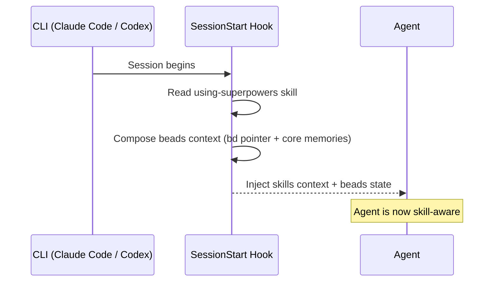

---
sidebar:
  order: 2
description: Install beads-superpowers via the native plugin system, curl, or npx for Claude Code, Codex, and OpenCode. Set up your first project with bd init in under 5 minutes.
---

<!-- Role: install + first-session setup, per harness. Does NOT belong here: how the workflow runs (workflow.md) or what the machinery does with memory (memory.md). -->

# Getting Started

## Prerequisites

**`bd` must be installed before the plugin will work.** The plugin registers hooks that call `bd` on every session start; if `bd` isn't present, those hooks fail silently and you lose persistent memory.

```bash
brew install beads          # macOS / Linux
# or
npm install -g @beads/bd    # any platform
```

Verify with `bd version`. Then install the plugin (see below), then run `bd init` in each project.

**Note:** Native plugin install (Tier 1) installs skills automatically for all three. Hooks come along too for Claude Code and OpenCode - Codex needs the scripted installer to wire its SessionStart hook (see Codex CLI below). None of the three runs `bd init` for you - do that yourself per project.

**Optional:** A [DoltHub](https://dolthub.com) account if you want cross-session sync via `bd dolt push/pull`. Without it, beads still works locally.

!!! info "Go deeper - upstream Beads docs"
    - [Installation](https://gastownhall.github.io/beads/getting-started/installation) - every `bd` install channel (brew, npm, curl, go), platform notes, upgrades

## Supported Platforms

### Tier 1 - Verified

These paths are tested end-to-end. Prefer them.

| CLI | Install method |
|-----|---------------|
| Claude Code | Native plugin marketplace (see below) |
| Codex CLI | Native plugin marketplace + `codex_hooks = true` (see below) |
| OpenCode | git plugin spec in `opencode.json` (see below) |

### Tier 2 - Best-effort

Config validated; not E2E-tested by us. Use with that in mind.

| CLI | Install | Update | Notes |
|-----|---------|--------|-------|
| Cursor | `/add-plugin beads-superpowers` (in Cursor Agent) | Marketplace UI | config validated by us; not E2E-tested |
| GitHub Copilot CLI | `copilot plugin marketplace add DollarDill/beads-superpowers` then `copilot plugin install beads-superpowers@beads-superpowers-marketplace` | `copilot plugin update beads-superpowers` | rides the Claude-plugin fallback (skills + session-start via the shared `hooks/hooks.json`), the same mechanism upstream ships; requires Copilot CLI v1.0.11+ |
| Kimi Code | `/plugins install https://github.com/DollarDill/beads-superpowers` (run `/new` after) | - | |
| Antigravity | `agy plugin install https://github.com/DollarDill/beads-superpowers` | - | reuses the Claude plugin manifest - the same mechanism upstream verified; not E2E-tested by us |
| Factory Droid | `droid plugin marketplace add https://github.com/DollarDill/beads-superpowers` then `droid plugin install beads-superpowers@beads-superpowers-marketplace` | - | reuses the Claude plugin manifest - the same mechanism upstream verified; not E2E-tested by us |
| Pi | `pi install git:github.com/DollarDill/beads-superpowers` | - | config validated by us; not E2E-tested |

## Install the plugin

> **⚠️ Coexistence warning:** Do not install alongside [obra/superpowers](https://github.com/obra/superpowers). Skill names collide - pick one or the other.

### Claude Code

```bash
claude plugin marketplace add DollarDill/beads-superpowers
claude plugin install beads-superpowers@beads-superpowers-marketplace
```

Or as slash commands inside a Claude Code session: `/plugin marketplace add DollarDill/beads-superpowers` then `/plugin install beads-superpowers@beads-superpowers-marketplace`.

### Codex CLI

```bash
codex plugin marketplace add DollarDill/beads-superpowers
codex plugin install beads-superpowers@beads-superpowers-marketplace
```

After installing, enable hooks in `~/.codex/config.toml`:

```toml
[features]
codex_hooks = true
```

To get the SessionStart hook under Codex, use the scripted installer (`install.sh`) rather than the plugin channel - the plugin channel installs the skills but does not wire the hook.

### OpenCode

Add to the `plugin` array in your `opencode.json` (global or project-level):

```json
{
  "plugin": ["beads-superpowers@git+https://github.com/DollarDill/beads-superpowers.git"]
}
```

Restart OpenCode. Skills auto-register and the session bootstrap + beads context inject automatically - no other steps. Details, version pinning, migration from pre-0.12 installer copies, and troubleshooting: [.opencode/INSTALL.md](https://github.com/DollarDill/beads-superpowers/blob/main/.opencode/INSTALL.md).

### Scripted install (`curl | bash`)

The curl installer also works for Claude Code and Codex when you need more than a plain plugin install:

```bash
curl -fsSL https://raw.githubusercontent.com/DollarDill/beads-superpowers/main/install.sh | bash
```

The installer auto-detects which CLIs are on your system and installs skills and hooks for each:

| CLI | Skills path | Hooks / Plugin |
|-----|------------|----------------|
| Claude Code | `~/.claude/skills/` | SessionStart hook in `settings.json` |
| Codex | `~/.codex/skills/` | Enable with `codex_hooks = true` in `~/.codex/config.toml` |

Use the scripted install when you need any of:

- **Beads/Dolt bootstrap** - auto-detects whether `bd` is installed and guides setup
- **Hook registration** - writes the SessionStart entry to `settings.json` (required when using npx or manual install paths)
- **`yegge.md` orchestrator** - optional add-on: installed only when you pass `--with-yegge`. The flag forces the scripted tarball/git install tier (the plugin and npx tiers are skipped for that run), so it can't be combined with a plugin-managed install in one command
- **Version pinning** - `--version X.Y.Z` for reproducible CI installs
- **CI environments** - use `--yes --skip-checksum` for unattended runs

Supports `--yes` (skip prompts), `--version X.Y.Z`, `--with-yegge`, `--dry-run`, `--skip-checksum`, and `--uninstall`.

### npx (Vercel Skills CLI)

```bash
npx skills add DollarDill/beads-superpowers -a claude-code -g --copy -y
# Use -a codex to also install for Codex CLI.
```

Installs the skills only - no hooks. Skill activation relies on your harness's native skill discovery. For the full experience (session-start injection of skill context + a composed beads context), use the plugin install or the scripted install above. To get beads context on an npx install, run `bd setup claude` (beads' own hook installer).

## First project setup

Initialise beads in your project:

```bash
cd your-project
bd init
```

This creates `.beads/` (config, metadata, git hooks), `CLAUDE.md`, and `AGENTS.md`. The plugin's session-start hook automatically detects if `bd setup claude` hooks are present and skips its own beads-context section, so no manual cleanup is needed.

### Add a dedicated beads remote

Set this up in the same pass as `bd init`, not as an afterthought: add a **dedicated beads remote** - a repo separate from your code - so your task history syncs across sessions and machines.

```bash
bd dolt remote add origin git@github.com:your-org/your-repo-beads.git
bd dolt push    # test the connection
```

A brand-new empty remote needs an initial commit before that first push succeeds - create it with a README, then add the remote and push.

Dolt history retains deleted rows, so a remote that matches your code repo makes that full history public too. A dedicated private repo keeps issue data auth-gated while your code stays public. bd releases after v1.1.0 enforce this with a collision guard: `bd dolt remote add` refuses a URL matching your git origin unless you pass `--allow-git-origin`. Same-repo sync is still available behind that flag - it's an explicit opt-in, not the default.

Without a remote, beads still works entirely locally.

!!! info "Go deeper - upstream Beads docs"
    - [Core concepts](https://gastownhall.github.io/beads/core-concepts) - how the Dolt-backed database and sync model work
    - [Recovery guides](https://gastownhall.github.io/beads/recovery) - when a sync fails or history diverges

## Updating

**Claude Code:**

```bash
claude plugin marketplace update beads-superpowers-marketplace
```

**Codex CLI:**

```bash
codex plugin marketplace update beads-superpowers-marketplace
```

**Copilot CLI:**

```bash
copilot plugin update beads-superpowers
```

**Scripted / npx:**

```bash
curl -fsSL https://raw.githubusercontent.com/DollarDill/beads-superpowers/main/install.sh | bash
# or
npx skills add DollarDill/beads-superpowers -g --copy -y
```

Re-running the installer or `npx skills add` overwrites the existing installation. No `bd init` needed - your existing `.beads/` database is untouched.

**OpenCode:**

Restart OpenCode to pick up the latest commit from the git plugin spec. Some OpenCode/Bun versions cache the resolved git dependency - clear OpenCode's package cache or reinstall the plugin if updates don't appear. To pin a specific version, append a `#vX.Y.Z` ref to the plugin spec. Details: [.opencode/INSTALL.md](https://github.com/DollarDill/beads-superpowers/blob/main/.opencode/INSTALL.md).

## Verify it works

Start a fresh session in your CLI of choice, then:

1. **Check skills loaded:** Type `/skills` (Claude Code/Codex) or check the skill list in OpenCode - you should see {{ skill_count }} skills prefixed with `beads-superpowers:`
2. **Check beads works:** Run `bd ready` and `bd stats` in the terminal

If skills aren't showing, the plugin may not be installed for your CLI. If `bd ready` fails, beads isn't initialised in this project (`bd init`).

## Your first session

When that session starts, the SessionStart hook fires automatically: it injects the skills bootstrap alongside a composed beads context - curated core memories plus a pointer into the knowledge store - so the agent starts oriented instead of blank. You don't have to trigger this yourself; it happens before the agent's first reply.

See [Memory & Sessions](memory.md) for what gets curated and how the knowledge store persists across sessions.

## How the hooks work

Claude Code and Codex share one hook script - **SessionStart** - registered via `hooks/hooks.json` for Claude Code and wired by `install.sh` for Codex. It fires on every session start, clear, and compact: it reads the `using-superpowers` skill, then composes the beads context described above. If `bd prime` is already registered as a hook elsewhere, the beads half is skipped automatically to avoid injecting it twice.



OpenCode uses its own JavaScript plugin (`.opencode/plugins/beads-superpowers.js`) instead of `hooks/hooks.json`, with three in-process hooks: a `config` hook auto-registers the skills, an `experimental.chat.messages.transform` hook injects the same bootstrap into the first user message once per session, and an `experimental.session.compacting` hook re-injects beads context after the context window compacts.

For the curation rules behind that context - salience thresholds, byte budget, what gets dropped - see [Memory & Sessions](memory.md).

## Configuration

**Instruction priority** when things conflict:

1. Your project's `CLAUDE.md` (highest)
2. Plugin skills
3. Default system prompt (lowest)

To override a skill's behaviour, add instructions to your project's `CLAUDE.md` - no need to fork the plugin.

**Beads project config** lives in `.beads/config.yaml`. The defaults work for most projects.

## Troubleshooting

**Skills not loading** - Run `/plugins` to check the plugin is installed, then `/skills` to check skills are visible. If missing, reinstall: `claude plugin marketplace update beads-superpowers-marketplace`.

**`bd: command not found`** - Beads isn't installed or isn't on your PATH. Run `brew install beads` or `npm install -g @beads/bd`, then verify with `bd version`.

**No `.beads` directory** - Run `bd init` in your project directory. The plugin automatically handles duplicate hook detection.

**Double context injection** - The plugin detects `bd setup claude` hooks in project and global settings and automatically skips its own beads-context section; same-event double-firing under multi-scope hook registration is suppressed by a dedup marker. If you still see duplicates, run `bd setup claude --remove`.

**A `.beads/PRIME.md` file appeared** - that's the plugin's guarded safety net: it makes a stray `bd prime` call emit a lean pointer instead of the full memory dump. It is only written when `.beads/` exists and never overwrites an existing file. Disable with `bd config set custom.prime-safety-net false`.

**Stale plugin cache** - The cache doesn't update when you edit skill files locally. Either symlink the cache to your checkout:

```bash
rm -rf ~/.claude/plugins/cache/beads-superpowers-marketplace/beads-superpowers/{{ version }}
ln -s ~/workplace/beads-superpowers \
  ~/.claude/plugins/cache/beads-superpowers-marketplace/beads-superpowers/{{ version }}
```

Or reinstall. Note: `claude plugin update` has a known [cache bug](https://github.com/anthropics/claude-code/issues/14061) - the symlink is more reliable.

**Hook not firing** - Check the hook is executable: `chmod +x hooks/session-start`.

**Stale reminder hook after updating from ≤0.8.2** - Earlier versions registered a per-prompt `superpowers-reminder.sh` hook that no longer ships. Re-run the scripted installer (`install.sh`) - it detects the stale `UserPromptSubmit` entry and removes it automatically. If `python3` isn't available, it prints the settings-file entry to remove by hand.

**`bd dolt push` fails** - You need a beads remote configured first: `bd dolt remote add origin <url>` (use a dedicated beads remote, not your code repo's URL - bd releases after v1.1.0 refuse a URL matching git origin unless you pass `--allow-git-origin`). If you don't need remote sync, the failure is harmless - beads works fine locally.
