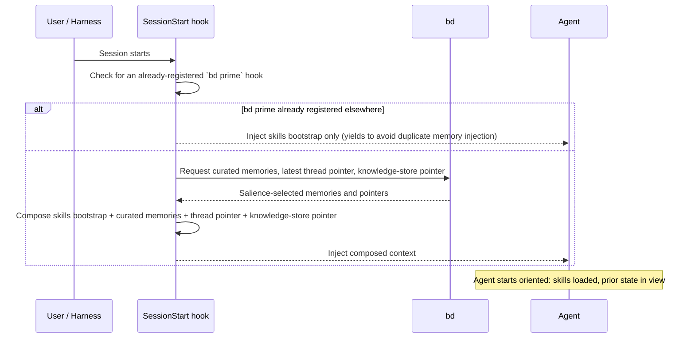
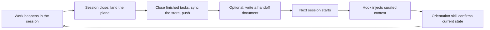

<!-- Role: what the machinery does with memory across a session's life - injection, curation, the knowledge store, the session loop. Does NOT belong here: why these designs were chosen (philosophy.md) or bd command reference (upstream Beads docs). -->

# Memory & Sessions

Every session starts from zero context and ends with the process gone. What survives between the two is whatever this plugin wrote down and handed back at the next start. This page describes that machinery: what gets injected when a session opens, how a raw note becomes a durable memory or a reference item, and what the loop looks like from one session to the next. For why the plugin is shaped this way rather than some other way, see [philosophy.md](philosophy.md).

## What happens when a session starts

A `SessionStart` hook runs before the agent sees your first message. It reads the `using-superpowers` skill (the bootstrap that routes to every other skill), then composes a beads context alongside it: a curated selection of memories, a pointer to the latest continuation thread, and a pointer to the knowledge store. All of it lands in the agent's context before you type anything.

The curated memory selection favors a handful of high-salience entries over the entire store, not an exhaustive dump, so a session that has accumulated hundreds of memories doesn't open every one of them at once. If another hook already registered `bd prime` for this project, the SessionStart hook detects it and yields, so beads context is never injected twice.



## What a memory is here

"Memory" covers two different stores, and the difference is what decides whether something shows up unasked or waits until you go looking for it.

| Store | Holds | Surfaced how | Synthetic example |
|---|---|---|---|
| Injected memory | Lessons, patterns, root causes, and corrections: standalone rules you want handed back unprompted | At every session start, salience-selected | "lesson: the staging config lives in `config/staging.yaml`, not the repo root" |
| Deferred knowledge-bead | Research, design notes, and decisions: reference material you'd re-open when a related question comes up | On demand, by topic label or keyword search | "design: why the retry queue uses exponential backoff instead of a fixed interval" |

Both stores persist and sync with your beads database, but only the first one gets pushed into a session's face unprompted. A deferred knowledge-bead is a pointer, not dead storage: it's there the moment you search for it.

## How memories are curated

A memory starts life as a raw note, typically captured with `bd remember` at the point a skill finishes a piece of work. From there, a curation sweep classifies it and routes it: lessons, patterns, root causes, and corrections stay as injected memories; research notes, design rationale, and decisions become deferred knowledge-beads instead. Neither branch is the end of the road - a routed item still gets retrieved later, updated in place as understanding changes, or superseded and tombstoned once something replaces it.

```mermaid
flowchart TD
  A["A skill finishes a piece of work"] --> B["`bd remember` captures a raw note"]
  B --> C["Curation sweep classifies the note"]
  C -->|"lesson / pattern / root-cause / correction"| D["Stays an injected memory"]
  C -->|"research / design / decision"| E["Becomes a deferred knowledge-bead"]
  D --> F["Resurfaced at a later session start"]
  E --> G["Retrieved on demand, by topic or keyword"]
  F --> H["Updated in place, or superseded / tombstoned"]
  G --> H
```

The sweep never applies its own conclusions. It proposes a full list of what it wants to add, update, consolidate, or forget, and waits for approval before touching the store, because a bad automated pass would otherwise corrupt what every future session sees.

## The session loop

One session's close feeds the next session's start. Work happens, then the session closes: finished tasks get closed out, the store syncs, and the result gets pushed. From there, a handoff document is optional; some sessions end cleanly enough that the injected memories and knowledge-store pointers carry the thread on their own, while others benefit from a written note pointing at what's next. Whichever path it takes, the next session opens already oriented, since the hook injects its composed context and an orientation skill can pull the current state together on request.



## Querying the knowledge store

The deferred knowledge-bead store is searched, not browsed. Two entry points cover most lookups:

```bash
bd list --label <topic> --status all       # by topic label
bd search "<keyword>" --status all         # by keyword (titles only)
```

A title match doesn't mean the body says what you need. Search is titles-only by default, so reach for a body-term search when the keyword you care about lives inside the text instead of the title:

```bash
bd list --label kb --status all --desc-contains "<term>"
```

Treat every hit list as an index, not an answer. Read the bodies before you rely on any of it:

```bash
bd show <id1> <id2>
```

If you're bringing an existing pile of ADRs, wikis, or research notes into this store rather than starting from an empty one, see the [migration guide](migration.md).

## Running without bd

The skills in this plugin are plain instructions, and they work with or without `bd` installed. What you lose without it is everything on this page: nothing gets injected at session start, nothing gets curated, and there's no knowledge store to search. Each session starts cold, and whatever you learned in the last one has to be re-explained by hand.
