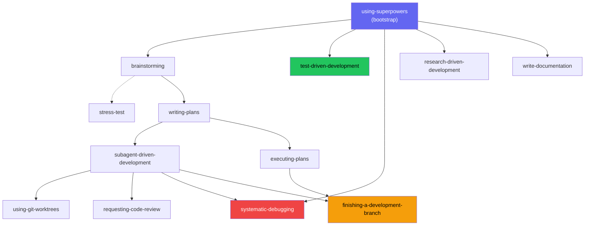

<!-- Role: the full per-skill reference - what each skill does and when it triggers. Does NOT belong here: the pipeline walkthrough (workflow.md) or install steps (getting-started.md). -->

# Skills Reference

beads-superpowers ships {{ skill_count }} composable skills loaded on demand via the `Skill` tool. The bootstrap skill `using-superpowers` loads at every session start and routes to the right skill for the current task. Skills are mandatory - when one applies, the agent must invoke it.

A maintainer-only audit skill lives outside the distributed set and isn't covered here.

## Trigger map

The `using-superpowers` bootstrap, injected at session start, tells the agent which skill applies to which task:

| Task | Skill |
|---|---|
| Bug or test failure | `systematic-debugging` |
| Writing code | `test-driven-development` |
| New feature or design | `brainstorming` |
| Stress-test a design | `stress-test` |
| Writing a plan | `writing-plans` |
| Executing a plan | `subagent-driven-development` / `executing-plans` |
| Research question | `research-driven-development` |
| Isolated workspace needed | `using-git-worktrees` |
| About to claim done | `verification-before-completion` |
| Code review needed | `requesting-code-review` |
| Received review feedback | `receiving-code-review` |
| Writing human-facing prose | `write-documentation` |
| Branch complete | `finishing-a-development-branch` |
| Consolidate or dedup memories | `memory-curator` |
| Hand work to the next session | `session-handoff` (human-invoked) |

Also available: `document-release`, `getting-up-to-speed`, `dispatching-parallel-agents`, `project-init`

## By category

| Category | Skills |
|---|---|
| **Meta** | [using-superpowers](#using-superpowers) |
| **Testing** | [test-driven-development](#test-driven-development) |
| **Debugging** | [systematic-debugging](#systematic-debugging), [verification-before-completion](#verification-before-completion) |
| **Design & planning** | [brainstorming](#brainstorming), [stress-test](#stress-test), [writing-plans](#writing-plans) |
| **Execution** | [subagent-driven-development](#subagent-driven-development), [executing-plans](#executing-plans), [dispatching-parallel-agents](#dispatching-parallel-agents), [using-git-worktrees](#using-git-worktrees), [requesting-code-review](#requesting-code-review), [receiving-code-review](#receiving-code-review), [finishing-a-development-branch](#finishing-a-development-branch) |
| **Documentation** | [write-documentation](#write-documentation), [document-release](#document-release) |
| **Memory & orientation** | [getting-up-to-speed](#getting-up-to-speed), [memory-curator](#memory-curator), [session-handoff](#session-handoff), [research-driven-development](#research-driven-development), [project-init](#project-init) |

```mermaid
---
config:
  flowchart:
    nodeSpacing: 70
    rankSpacing: 70
---
graph TD
  subgraph Meta
    US["using-superpowers"]
  end
  subgraph Testing
    TDD["test-driven-development"]
  end
  subgraph Debugging
    SD["systematic-debugging"]
    VBC["verification-before-completion"]
  end
  subgraph Design ["Design & planning"]
    BR["brainstorming"]
    STR["stress-test"]
    WP["writing-plans"]
  end
  subgraph Execution
    SDD["subagent-driven-dev"]
    EP["executing-plans"]
    DPA["dispatching-parallel"]
    WT["using-git-worktrees"]
    RCR["requesting-review"]
    REC["receiving-review"]
    FAB["finishing-branch"]
  end
  subgraph Documentation
    WD["write-documentation"]
    DR["document-release"]
  end
  subgraph Memory ["Memory & orientation"]
    GUS["getting-up-to-speed"]
    MC["memory-curator"]
    SH["session-handoff"]
    RDD["research-driven-dev"]
    PI["project-init"]
  end

  Meta --> Testing
  Testing --> Debugging
  Debugging --> Design
  Design --> Execution
  Execution --> Documentation
  Documentation --> Memory

  style Meta fill:#6366f1,color:#fff
  style Testing fill:#22c55e,color:#000
  style Debugging fill:#ef4444,color:#fff
  style Design fill:#818cf8,color:#fff
  style Execution fill:#14b8a6,color:#000
  style Documentation fill:#ec4899,color:#fff
  style Memory fill:#8b5cf6,color:#fff
```

## All skills

### using-superpowers

Bootstrap skill injected at every session start. Routes the agent to the correct skill for the current task, and carries the production-grade doctrine that holds every session to a no-shortcuts, no-silent-descope, never-a-security-regression standard. It also carries the decision-capture convention: when a choice is hard to reverse, surprising, and a genuine trade-off, the agent offers to record an ADR in `docs/decisions/`. All other skills depend on this one having loaded first.

### test-driven-development

**Trigger:** Before writing any implementation code.

Iron Law: no production code without a failing test first - explicit failing-test output required before touching any implementation. RED-GREEN-REFACTOR, no shortcuts.

### systematic-debugging

**Trigger:** Any bug, test failure, or unexpected behavior - before proposing fixes.

Four-phase root cause analysis: observe, hypothesize, isolate, fix. Requires a confirmed root cause before any code change. Blocks "just try this and see."

### verification-before-completion

**Trigger:** Before claiming work is done, fixed, or passing.

The agent must run verification commands and show actual output - not assert from memory - before closing a bead or creating a PR. Evidence before assertions.

### brainstorming

**Trigger:** Before any creative work - features, components, or behavior changes.

Socratic design exploration. Asks structured questions to surface requirements, constraints, and design alternatives. Produces a committed design spec. Ends by invoking `writing-plans`, not by jumping to code.

### stress-test

**Trigger:** When a design or plan needs adversarial scrutiny. Also triggers on "grill me", "poke holes", "challenge this design".

Interrogates every branch of the decision tree, proposing a recommended answer for each and requiring the user to explicitly agree or push back rather than rubber-stamping the whole set. Tracks branch resolution progress, writes findings inline (Mode A) or to a standalone report (Mode B), and runs a reflexion self-review before closing. Typically runs between brainstorming and writing-plans.

### writing-plans

**Trigger:** When you have a spec or requirements for a multi-step task.

Breaks a design into bite-sized tasks (2-5 minutes each) with exact file paths, code, and verification steps. Every task becomes a bead with dependency ordering.

### subagent-driven-development

**Trigger:** When executing a plan with independent tasks.

Dispatches a fresh subagent per task with a single read-only task review between tasks - one reviewer returns a spec-compliance verdict and a code-quality verdict in one pass. The orchestrator tracks beads; subagents don't touch them. When multiple tasks are unblocked, **parallel batch mode** runs up to 5 concurrently, each in its own worktree.

### executing-plans

**Trigger:** When executing a plan in a single session with review checkpoints.

Runs a multi-phase plan sequentially: claim, implement, verify against acceptance criteria, close, next phase. Designed to complement `writing-plans` output directly.

### dispatching-parallel-agents

**Trigger:** When facing 2+ independent tasks without shared state.

Coordinates concurrent subagents for independent work - plan tasks, subsystem changes, anything without shared mutable state. Used by SDD's parallel batch mode for the dispatch pattern.

### using-git-worktrees

**Trigger:** Feature work needing isolation, or before executing plans.

Creates and manages isolated git worktrees via `bd worktree`. Pre-flight checks detect existing worktree isolation, submodule contexts, and prompt for consent (skipped when SDD-dispatched). Supports multiple concurrent worktrees for parallel subagent work - one per task, max 5. Use `bd -C .worktrees/<name>` for cross-worktree commands.

### requesting-code-review

**Trigger:** After completing tasks, major features, or before merging.

Dispatches a code reviewer subagent that checks the diff against the original requirements, reporting strengths, issues grouped by severity, and an overall assessment. The reviewer gets the original requirements alongside the diff.

### receiving-code-review

**Trigger:** When review feedback arrives, especially if unclear or questionable.

Anti-sycophancy protocol: requires technical evaluation of each suggestion rather than blind acceptance, with disagreements escalated explicitly.

### finishing-a-development-branch

**Trigger:** Implementation complete, tests pass, ready to integrate.

Detects environment (normal repo, named-branch worktree, or detached HEAD) and adapts options - 4 choices for normal/worktree, 3 for detached HEAD (no merge). A docs-audit gate runs before the options: `document-release` must have run on the branch, or is invoked on the spot (doc-irrelevant diffs exit cheaply). Provenance-based cleanup only removes `.worktrees/` paths. Ends with the mandatory Land the Plane sequence: `bd close` → `bd dolt push` → `git push`.

### write-documentation

**Trigger:** Writing or rewriting human-facing prose - docs, guides, emails, PR descriptions, release notes.

14-rule writing system adapted from [WRITING.md](https://github.com/Anbeeld/WRITING.md). Context-first drafting, required checks as revision pass, targets the patterns that make LLM prose recognizable (regularity, catalog prose, false crispness). Pairs with `document-release` (which handles *when* to update, not *how* to write).

### document-release

**Trigger:** Branch complete and about to merge or PR - including via finishing-a-development-branch's docs-audit gate - after code changes are committed.

Walks through README, CHANGELOG, CLAUDE.md, CONTRIBUTING, and other docs to find and fix drift against shipped code. A coverage map catches docs that are missing entirely - a new flag or command with no reference page - not only stale ones, and each CHANGELOG entry is scored against a what-changed, why-care, how-to-use test.

### getting-up-to-speed

**Trigger:** Session start, after compaction, or "catch me up" / "where are we".

Gathers beads state and the newest handoff in one `orient.sh` call, deep-dives the codebase (sub-agent fan-out scales to repo size across `<40` / `40-150` / `>150` tracked-file bands), and produces a structured current-state summary. It reads the newest `.internal/handoff/` doc - written by its counterpart `session-handoff` - as an unread inbox, folding it into the summary and then archiving it at close so a later session doesn't re-read it; a HEAD-recency backstop flags a handoff as stale when `HEAD` has moved past the commit it recorded. A pre-emit verification gate holds every claim in the summary to a command actually run in the session, a beads-versus-git check flags work that shipped but was left open, and superseded `continuation-*` memories are pruned at close.

### memory-curator

**Trigger:** At session-close when several new memories were captured, or on-demand for a full sweep.

Turns a session's raw `bd remember` notes into well-structured, deduplicated, consolidated memories using the in-session agent - no runtime, key, or embeddings. The scope is deliberately evidence-led: quality-gated capture, reflection-consolidation, and pruning, not structural richness. It never mutates the store silently - it proposes a reviewed command list, and you approve before anything is written.

### session-handoff

**Human-invoked only.** Writes a grounded session-handoff document and stores a `bd remember` continuation note so the next session can pick up in-progress work without relying on chat history. Its counterpart `getting-up-to-speed` consumes that document on the next session's orientation, then archives it.

### research-driven-development

**Trigger:** Research questions, "what is X", "how does Y work", "compare A vs B".

Decomposes the topic into sub-questions, dispatches one researcher per sub-question in parallel (plus `@explore` for codebase-relevant topics), then grounds every load-bearing claim with a separate blinded verifier that independently re-fetches the cited source and confirms it actually supports the claim before the finding is allowed into the document, and synthesizes the surviving findings into a persistent document with per-finding confidence. Iron Law: no research without a document - verbal answers without persistent artifacts are prohibited.

### project-init

**Trigger:** When `bd` commands fail, setting up beads in a new project, or recovering from diverged Dolt history.

Three paths: fresh init, bootstrap from remote, or recovery when Dolt history has diverged.

## Beads commands

Skills use `bd` commands to track work. Only the orchestrating agent manages beads - subagents don't touch them.

| Action | Command | Used in |
|---|---|---|
| Create epic | `bd create "Epic: name" -t epic` | SDD, executing-plans |
| Create task | `bd create "Task: name" -t task --parent <epic>` | SDD, executing-plans |
| Atomic plan creation | `bd import` (JSONL, after `bd create` epic) | writing-plans, SDD |
| Quick capture | `bd q "title"` | any skill |
| Claim work | `bd update <id> --claim` | executing-plans |
| Complete work | `bd close <id> --reason "why"` | all execution skills |
| Check remaining | `bd ready --parent <epic>` | SDD, executing-plans |
| Compound query | `bd query "status=open AND priority<=1"` | getting-up-to-speed (replaces `bd list` + jq) |
| Grouped counts | `bd count --by-status` | getting-up-to-speed (also `--by-priority`/`--by-type`) |
| Add dependency | `bd dep add <child> <parent>` | SDD, writing-plans |
| Store learning | `bd remember "insight"` | most of the {{ skill_count }} skills prompt for this |
| Attach evidence | `bd note <id> "context"` | verification |
| Explain dependencies | `bd ready --explain` | systematic-debugging, executing-plans |
| Sync to remote | `bd dolt push` | finishing-a-development-branch |

!!! info "Go deeper - upstream Beads docs"
    - [CLI reference](https://gastownhall.github.io/beads/cli-reference) - the full `bd` command surface beyond the workflow-core set above (`batch`, `lint`, `defer`, `human`, `swarm`, `-C`, …)

## How skills chain

Edges show direct skill-to-skill invocations only - transitions managed by the orchestrator (e.g., verification → document-release → finishing) are omitted. Dashed edges are optional. Skills like `systematic-debugging`, `verification-before-completion`, and `receiving-code-review` fire whenever their trigger is met, regardless of workflow position.
