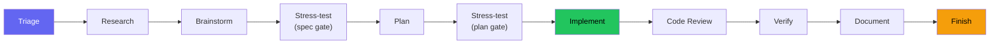
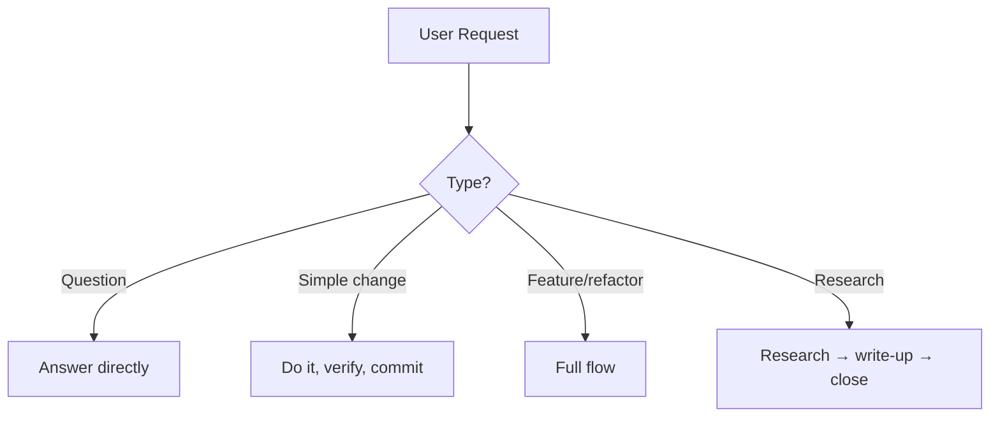
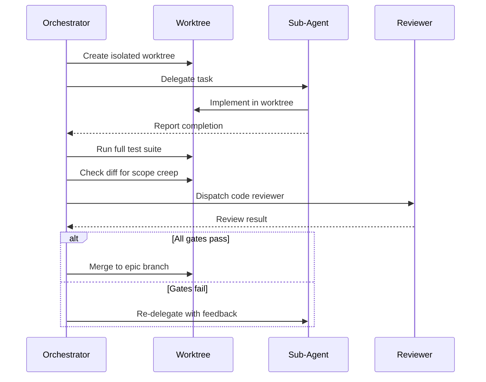

<!-- Role: a walkthrough of the pipeline a task actually travels. Does NOT belong here: per-skill reference detail (skills.md) or why the pipeline is shaped this way (philosophy.md). -->

# Example Workflow

How beads-superpowers skills orchestrate a development lifecycle. The `yegge` orchestrator triages each request and routes it to the skills that own each step; for non-trivial work it runs the full flow below and lets each skill enforce its own gates. It is a router, not a state machine - nothing is gated by an unenforceable "no step may be skipped" rule. For why the pipeline is shaped this way, see [philosophy.md](philosophy.md).

Want to use this workflow? Grab the [example-workflow/](https://github.com/DollarDill/beads-superpowers/tree/main/example-workflow) directory - it has a ready-to-use CLAUDE.md and the [yegge.md](https://github.com/DollarDill/beads-superpowers/blob/main/example-workflow/agents/yegge.md) orchestrator agent. The orchestrator is an optional add-on - install it globally with `install.sh --with-yegge` (it is not installed by default), or copy `agents/yegge.md` into your project manually.

## The flow

Research, brainstorming, and both stress-test gates scale with complexity - a typo fix skips straight to the tail: implement, code review, verify, document, finish. Those five quality steps run for every code change, and verification is required on every path, including the lightest one.

## Triage

Every request is classified first, and the classification decides how much process it gets:

| Type | Examples | Path |
|---|---|---|
| Quick question | "What does this file do?" | Answer directly, no bead |
| Simple change | "Fix this typo" | Do it directly, verify, commit - no worktree or PR |
| Non-trivial | "Add a new feature" | The full flow |
| Research query | "How does X work?" | Research, write the findings, done |

Complexity scales the research and planning depth, not the quality gates. A simple change still gets verified; it just skips the worktree, both stress-test gates, the formal code review, the doc audit, and the PR ceremony.

## The steps

### Setup

Create a bead (`bd create`), claim it (`bd update --claim`), and sync the beads DB (`bd dolt pull` when a remote is configured). If the session dies, the bead record shows the in-progress work so the next session can recover it.

### Research

`research-driven-development` runs when the task needs understanding first - an unfamiliar library, an ambiguous requirement, a design question with no clear precedent. It decomposes the topic into sub-questions and dispatches one researcher per sub-question in parallel, with an `@explore` agent mapping affected code and dependencies when the topic is codebase-relevant.

The orchestrator then verifies each load-bearing claim against the verbatim quote its researcher returned, running a capped gap-closing round (up to two) when a claim rests on a single source. The findings go into a persistent document, with key learnings stored via `bd remember` - the same pass that surfaces any contradiction between what the researcher and the explorer found, before it reaches implementation.

### Brainstorm

`brainstorming` explores the solution space through structured questions, surfaces assumptions, and produces a design spec committed to git. The design must be user-approved before anything moves forward, and the spec-review gate offers a `stress-test` every time to interrogate it adversarially.

### Decision capture

When a choice is hard to reverse, surprising without its context, and a real trade-off, the agent offers to record an ADR in `docs/decisions/` - context, decision, consequences, alternatives considered. The agent leans toward offering whenever a decision plausibly fits these marks; only routine clarifications and scope calls fall outside. It turns an implicit decision into an explicit record a later reader can trace. The same capture gate reappears after stress-test and after writing-plans - wherever a design settles, not just here.

### Stress-test (spec gate)

`stress-test` interrogates the approved spec branch by branch: architecture, assumptions, edge cases, the mandatory security branch - each with a recommended answer, and each needs an explicit agree or push back before it counts as resolved. It's offered every time a spec is approved, right before writing-plans; see [stress-test](skills.md#stress-test) for how branches get tracked and findings written back to the spec.

### Plan

`writing-plans` breaks the design into bite-sized tasks (2–5 minutes each) with exact file paths, code, and verification steps, and every task becomes a bead. The plan must be user-approved. There is no "TBD" or "as needed" - every step is concrete, or the plan isn't ready.

### Stress-test (plan gate)

The same adversarial pass runs again once the plan is written, this time against task boundaries, parallel-safety, and failure modes instead of design choices. It's offered every time a plan is approved, with the same recommend-then-agree-or-push-back rhythm, right before execution begins - see [stress-test](skills.md#stress-test).

### Implement

Once the plan clears its stress-test gate (or skips it), the orchestrator picks how to run it: subagent-driven-development stays in this session, dispatching a fresh subagent per task inside an isolated worktree under TDD (red-green-refactor); executing-plans instead runs the same plan in a separate session, task by task, without subagent dispatch. Either way, the orchestrator creates an epic bead with task children and dependency chains before dispatching.

Before creating the worktree, the skill runs pre-flight checks: it confirms the agent isn't already inside a worktree or a submodule, and asks for consent when a human, rather than the SDD automation, kicked it off.

When several tasks are unblocked, **parallel batch mode** runs up to five concurrently, each in its own worktree (mechanics: [subagent-driven-development](skills.md#subagent-driven-development)); sequential mode runs one at a time when tasks depend on each other. Every subagent result passes through the [review gate](#review-gate) before it's accepted, and the initial epic and tasks are created with `bd import` (JSONL, after `bd create` for the epic); `bd batch` handles `blocks` ordering and subsequent close and update operations.

!!! info "Go deeper - upstream Beads docs"
    - [Multi-agent coordination](https://gastownhall.github.io/beads/multi-agent) - the tool-level primitives beneath parallel batch mode

### Code Review

After every task passes its own [review gate](#review-gate), the orchestrator dispatches one more code reviewer against the whole branch: the same `requesting-code-review` skill, now scoped to the full diff against the plan instead of one task. Critical findings block progress until fixed, and pushback on the feedback goes through `receiving-code-review`'s anti-sycophancy check rather than reflexive agreement (see [requesting-code-review](skills.md#requesting-code-review) and [receiving-code-review](skills.md#receiving-code-review)).

### Verify

`verification-before-completion` runs the full test suite fresh, rather than trusting the last run during development. "Tests pass" means a test command was just executed and its output is attached. This holds on every path, the light one included.

### Document

`document-release` scans the diff against the existing docs for stale references, missing entries, and outdated examples. When the audit flags a section that needs a real prose rewrite, `write-documentation` takes that section.

### Finish

`finishing-a-development-branch` ([skills.md](skills.md#finishing-a-development-branch)) detects the environment - normal repo, named-branch worktree, or detached HEAD - and presents context-aware options: four choices for normal and worktree contexts, three for detached HEAD, where merging is unavailable. Before the options appear, a docs-audit gate checks that `document-release` ([skills.md](skills.md#document-release)) has run on the branch, invoking it on the spot if not (doc-irrelevant diffs exit cheaply). Provenance-based cleanup only removes worktrees inside `.worktrees/`. It ends with the Land the Plane protocol: close beads, push to the remotes, verify a clean tree. Branch work isn't done until both `bd dolt push` and `git push` succeed.

### Session close

On non-branch paths - research queries, quick tasks that never created a branch - the same close ritual runs without the merge step: `bd close` → `bd dolt push` → `git push` → `git status`. If the session produced several new memories, the orchestrator offers a `memory-curator` pass before `bd dolt push`. The next session's start-hook injection restores the full picture.

## Review gate

When SDD delegates to a subagent, the result passes through four checks before it's accepted - the per-task loop, distinct from the whole-branch [Code Review](#code-review) pass that runs once all tasks are done:

1. **Test suite** - Run independently in the worktree. The subagent's own test run is not enough.
2. **Diff review** - Check for scope creep. Changes that aren't in the plan are grounds for rejection.
3. **Code review** - `requesting-code-review` verifies spec compliance against the acceptance criteria.
4. **Acceptance criteria** - Each criterion from the plan is verified explicitly.

A subagent reporting "done" is a claim, not evidence. The gate is what turns the claim into evidence.

## Interrupts

Two interrupts can fire at any point. They suspend the current step, handle the interrupt, and return.

**Debug** - Fires on bugs, test failures, or unexpected behavior. `systematic-debugging` enforces a four-phase investigation (observe → hypothesize → investigate → fix) before any code change, so you don't jump from "tests fail" to "try this fix" without understanding why.

**Code review** - Fires when review feedback arrives. `receiving-code-review` enforces anti-sycophantic reception: evaluate each suggestion technically, surface disagreements explicitly, and track what actually changed in response.

## Session protocol

**Start:** The SessionStart hook fires automatically, injecting skill context plus a composed beads context - a `bd` command pointer and the highest-salience persistent memories. Run `bd ready` to surface unblocked beads and in-progress work from previous sessions. Orient before claiming; claim before implementing. When starting work on a bead, process skills come first - brainstorming and planning before any implementation skill; a bead with an existing spec or plan proceeds straight to its planned skill.

**End:** Finish for code paths, Session close for non-branch paths. Close every bead with evidence; if the session produced several new memories, offer a `memory-curator` pass before the push. Push the beads remote, push git, verify a clean tree. A session with uncommitted work or unpushed commits hasn't landed - the push is what completion means.
