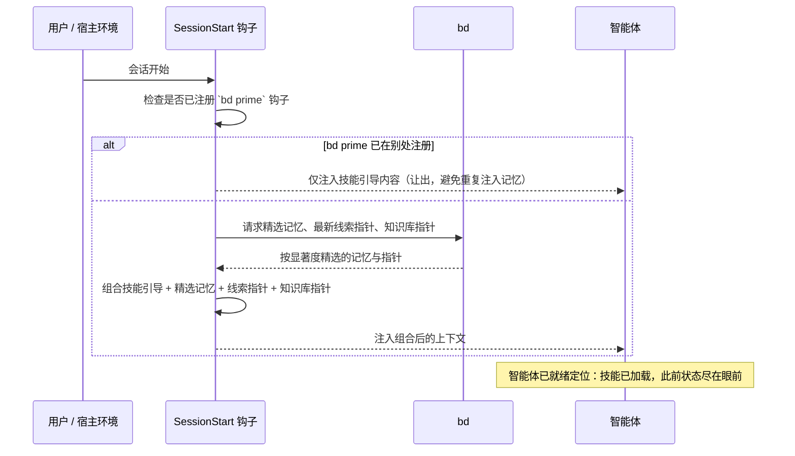

---
sidebar:
  order: 5
description: 记忆在一次会话生命周期中的流转——会话启动注入、整理、知识库与会话循环。
machine_translated: true
---
!!! warning "机器翻译"
    本页面由 AI 自动翻译，可能存在术语或语义偏差。如有疑问，请以[英文原文](memory.md)为准。

<!-- Role: 本页描述这套机制在一个会话生命周期内对记忆做的事——注入、整理、知识库、会话循环。不属于本页范围：为何选择这些设计（见 philosophy.md）或 bd 命令参考（见上游 Beads 文档）。 -->

# 记忆与会话

每个会话都从零上下文开始，随着进程终止而结束。在两者之间存活下来的，是这个插件写下并在下次启动时递还的东西。本页描述这套机制：会话开启时会注入什么、一条原始笔记如何变成一条持久记忆或一条参考条目，以及从一个会话到下一个会话的循环是什么样子。至于插件为何采用这种形态而非别的形态，请见 [philosophy.md](philosophy.md)。

## 会话启动时发生了什么

在智能体看到你的第一条消息之前，一个 `SessionStart` 钩子就已运行。它先读取 `using-superpowers` 技能（路由到所有其他技能的引导技能），然后在旁边组合出一份 beads 上下文：一份精选的记忆、一个指向最新 continuation 线索的指针，以及一个指向知识库的指针。这一切都会在你输入任何内容之前，落入智能体的上下文中。

精选的记忆偏向少数几条高显著度的条目，而非整个记忆库的穷举转储，因此一个已经积累了成百条记忆的会话，不会一次性把它们全部打开。如果这个项目里已有另一个钩子注册了 `bd prime`，SessionStart 钩子会检测到这一点并让出，因此 beads 上下文永远不会被注入两次。



## 这里的"记忆"是什么

"记忆"在这里涵盖两个不同的存储，而两者的区别决定了某样东西是会主动出现，还是要等你去找它才会出现。

| 存储 | 内容 | 如何浮现 | 合成示例 |
|---|---|---|---|
| 注入记忆 | 经验、模式、根因和纠正：你希望被主动递到手上的独立规则 | 每次会话开始时，按显著度精选 | "lesson：预发布环境的配置文件在 `config/staging.yaml` 里，而不是仓库根目录" |
| 延迟知识 bead | 研究笔记、设计说明和决策：你会在相关问题出现时重新翻开的参考材料 | 按需检索，通过主题标签或关键词 | "design：为什么重试队列使用指数退避，而不是固定间隔" |

两个存储都会持久化，并随你的 beads 数据库同步，但只有第一个会被主动推到会话面前。延迟知识 bead 是一个指针，而非死存储：你一搜索，它就在那里。

## 记忆如何被整理

一条记忆的生命始于一条原始笔记，通常在某个技能完成一项工作时由 `bd remember` 捕获。从那里起，一次整理扫描会对它分类并路由：经验、模式、根因和纠正留作注入记忆；研究笔记、设计理由和决策则变成延迟知识 bead。无论走哪条分支都不是终点——被路由后的条目仍会在之后被检索、随理解变化原地更新，或在有新内容取代它时被替换并立墓碑。

```mermaid
flowchart TD
  A["一个技能完成一项工作"] --> B["`bd remember` 捕获一条原始笔记"]
  B --> C["整理扫描对笔记分类"]
  C -->|"lesson / pattern / root-cause / correction"| D["留作注入记忆"]
  C -->|"research / design / decision"| E["变成延迟知识 bead"]
  D --> F["在之后的会话开始时再次浮现"]
  E --> G["按需检索，通过主题或关键词"]
  F --> H["原地更新，或被替换并立墓碑"]
  G --> H
```

这次扫描从不自行应用结论。它会提议一份完整清单，列出想要新增、更新、合并或遗忘的内容，并在触碰记忆库之前等待批准，因为一次糟糕的自动化操作会悄悄污染此后每个会话看到的内容。

## 会话循环

一个会话的收尾，衔接着下一个会话的开始。工作先发生，然后会话收尾：关闭已完成的任务、同步记忆库、推送结果。从这里起，交接文档是可选的：有些会话收尾得足够干净，注入记忆和知识库指针足以自行承接线索；另一些则受益于一份指明下一步的书面笔记。无论走哪条路径，下一个会话打开时都已就绪定位，因为钩子会注入它组合好的上下文，一个定位技能也可以按需把当前状态汇总起来。


## 查询知识库

延迟知识 bead 存储是靠搜索的，不是靠浏览的。两个入口覆盖了大多数查找：

```bash
bd list --label <topic> --status all       # 按主题标签
bd search "<keyword>" --status all         # 按关键词（仅匹配标题）
```

标题命中不代表正文说的就是你需要的内容。搜索默认只匹配标题，所以当你关心的关键词藏在正文而非标题里时，改用正文词条搜索：

```bash
bd list --label kb --status all --desc-contains "<term>"
```

把每一份命中列表当作索引，而非答案。在依赖任何内容之前，先读正文：

```bash
bd show <id1> <id2>
```

## 不使用 bd 运行

本插件里的技能都是纯文本指令，无论有没有安装 `bd`，它们都能用。没有它，你失去的就是本页所写的一切：会话开始时什么都不会被注入，什么都不会被整理，也没有知识库可供搜索。每个会话都从零开始，上一个会话学到的东西，都得靠手动重新讲一遍。
