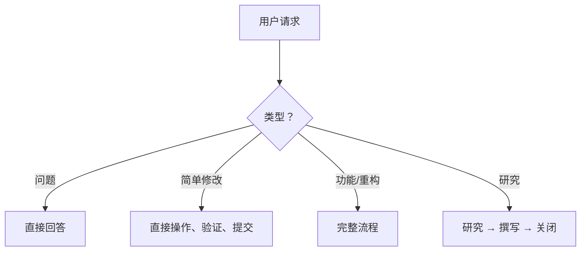
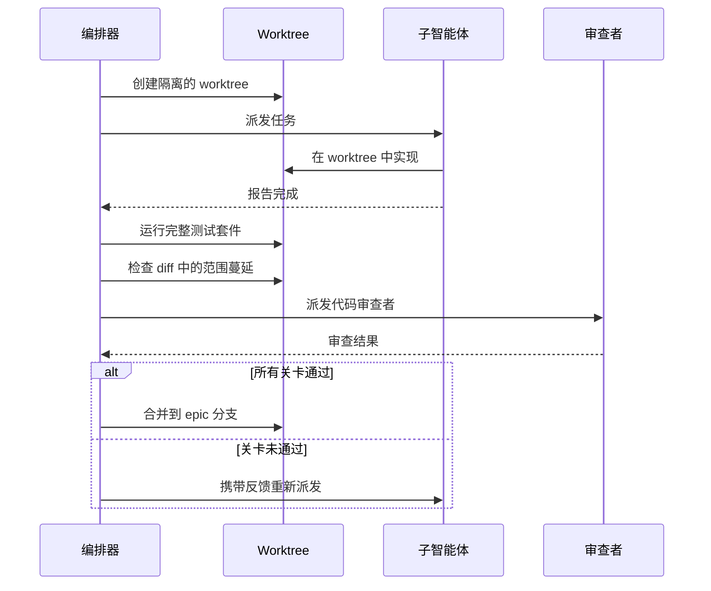

---
sidebar:
  order: 3
machine_translated: true
description: 一个精简的编排器对每个请求进行分类，并将其路由到负责每个步骤的技能——研究、计划、TDD 实现、审查门控和并行批处理模式——而不是一个僵化的状态机。
---

<!-- Role: a walkthrough of the pipeline a task actually travels. Does NOT belong here: per-skill reference detail (skills.md) or why the pipeline is shaped this way (philosophy.md). -->

!!! warning "机器翻译"
    本页面由 AI 自动翻译，可能存在术语或语义偏差。如有疑问，请以[英文原文](workflow.md)为准。

# 示例工作流

beads-superpowers 技能如何编排开发生命周期。`yegge` 编排器对每个请求进行分类，并将其路由到负责每个步骤的技能；对于非简单工作，它执行以下完整流程，让每个技能执行自己的门控。它是一个路由器，而非状态机——没有任何规则是靠不可执行的"不可跳过某步骤"约束来保证的。关于此流程为何如此设计，参见 [philosophy.md](philosophy.md)。

想使用此工作流？获取 [example-workflow/](https://github.com/DollarDill/beads-superpowers/tree/main/example-workflow) 目录——它包含 [yegge.md](https://github.com/DollarDill/beads-superpowers/blob/main/example-workflow/agents/yegge.md) 编排器智能体。编排器是可选附加组件——通过 `install.sh --with-yegge` 全局安装（默认不安装），或手动将 `agents/yegge.md` 复制到你的项目中。

## 流程

研究、brainstorming 和两次 `stress-test` 都会根据复杂度进行扩展——修复一个错别字可以直接跳到尾部：实现、代码审查、验证、文档、完成。这五个质量步骤在每次代码变更时都会执行，验证在每条路径上都是必须的，包括最轻量的路径。

## 分类（Triage）

每个请求首先进行分类，分类结果决定其所需流程的多少：

| 类型 | 示例 | 路径 |
|---|---|---|
| 快速问题 | "这个文件是做什么的？" | 直接回答，不创建 bead |
| 简单修改 | "修复这个错别字" | 直接操作，验证，提交——无需 worktree 或 PR |
| 非简单任务 | "添加新功能" | 完整流程 |
| 研究查询 | "X 是如何工作的？" | 研究，撰写发现，完成 |

复杂度决定研究和计划的深度，而非质量门控。简单修改仍需验证；只是跳过了 worktree、两次 `stress-test`、正式代码审查、文档审计和 PR 流程。

## 各步骤

### 初始化（Setup）

创建一个 bead（`bd create`），认领它（`bd update --claim`），并同步 Beads 数据库（如果配置了远程，则执行 `bd dolt pull`）。如果会话中断，bead 记录会显示进行中的工作，以便下一个会话恢复。

### 研究（Research）

`research-driven-development` 在任务需要先行理解时运行——不熟悉的库、含糊的需求、没有明确先例的设计问题。它将主题分解为子问题，并为每个子问题并行派发一个研究者智能体；当主题与代码库相关时，还会有一个 `@explore` 智能体映射受影响的代码和依赖关系。

编排器随后对每个关键性声明与其研究者返回的逐字引用进行验证，如果某个声明仅依赖单一来源，则运行一轮有限的差距弥补（最多两轮）。研究成果随后汇入一份持久化文档，关键学习成果通过 `bd remember` 存储——同一道工序也会让研究者和探索者之间的矛盾在到达实现阶段之前浮现。

### 头脑风暴（Brainstorm）

`brainstorming` 通过结构化问题探索解决方案空间，梳理假设，并生成提交到 git 的设计规格说明。设计必须经过用户批准才能继续，规格说明审查门控每次都提供 `stress-test` 选项以进行对抗性审查。

### 决策捕获（Decision capture）

当一个选择难以逆转、离开上下文令人困惑、且存在真实权衡时，智能体会提出在 `docs/decisions/` 目录中记录一条 ADR——包含背景、决策、后果和已考虑的替代方案。只要某个决策大体符合这些标志，智能体便倾向于提议记录；只有例行澄清和范围确认才排除在外。它将隐式决策转化为后续读者可以追溯的显式记录。同样的捕获门控也会在 `stress-test` 和 `writing-plans` 之后再次出现——只要设计有了定论就会触发，不止在这里。

### 压力测试（规格门）

`stress-test` 逐分支审问已批准的规格说明：架构、假设、边界情况、强制性的安全分支——每个分支都附有推荐答案，且在计为已解决之前都需要明确的同意或反驳。它在每次规格说明获批时都会被提供，紧接在 `writing-plans` 之前；分支如何被追踪、发现如何写回规格说明，参见 [stress-test](skills.md#stress-test)。

### 计划（Plan）

`writing-plans` 将设计拆分为小粒度任务（每项 2–5 分钟），包含精确的文件路径、代码和验证步骤，每个任务都成为一个 bead。计划必须经过用户批准。没有"待定"或"视需而定"——每个步骤都是具体的，否则计划尚未就绪。

### 压力测试（计划门）

同样的对抗性审查会在计划写完后再次运行，这次针对的是任务边界、并行安全性和失败模式，而非设计选择。它在每次计划获批时都会被提供，遵循同样的"先推荐、再同意或反驳"节奏，紧接在执行开始之前——参见 [stress-test](skills.md#stress-test)。

### 实现（Implement）

计划通过 `stress-test` 门控（或跳过它）后，编排器会选择执行方式：`subagent-driven-development` 留在本会话中，为每个任务在隔离的 worktree 内派发一个新的子智能体，遵循 TDD（red-green-refactor）；`executing-plans` 则改为在另一个会话中逐个任务执行同一份计划，不派发子智能体。无论哪种方式，编排器都会先创建带有子任务和依赖链的 epic bead，再开始派发。

在创建 worktree 之前，技能会运行预检：确认智能体未处于 worktree 或子模块内部，并在由人工而非 SDD 自动化启动时请求确认。

当多个任务处于未阻塞状态时，**并行批处理模式**最多并发运行五个任务，每个任务在自己的 worktree 中（机制详见 [subagent-driven-development](skills.md#subagent-driven-development)）；当任务之间存在依赖时，顺序模式每次运行一个任务。每个子智能体的结果在被接受前都必须经过[审查门控](#review-gate)；初始的 epic 和任务通过 `bd import`（JSONL，先用 `bd create` 创建 epic）创建；`bd batch` 负责 `blocks` 排序以及后续的关闭和更新操作。

!!! info "深入了解 — 上游 Beads 文档"
    - [多智能体协调](https://gastownhall.github.io/beads/multi-agent) — 并行批处理模式之下的工具级原语

### 代码审查（Code Review） 

每个任务各自通过[审查门控](#review-gate)之后，编排器会再派发一次代码审查——针对整个分支，仍是同一个 `requesting-code-review` 技能，只是这次的范围是对照计划的完整 diff，而非单个任务。严重问题会阻塞进度直到修复，对反馈的任何反驳都要经过 `receiving-code-review` 的反谄媚检查，而非条件反射式的接受（参见 [requesting-code-review](skills.md#requesting-code-review) 与 [receiving-code-review](skills.md#receiving-code-review)）。

### 验证（Verify）

`verification-before-completion` 重新运行完整测试套件，而不是信任开发过程中的上次运行。"测试通过"意味着刚刚执行了测试命令并附有其输出。这适用于每条路径，包括最轻量的那条。

### 文档（Document）

`document-release` 扫描 diff 与现有文档，查找过时的引用、缺失的条目和过时的示例。当审计标记出需要真正重写散文的部分时，`write-documentation` 负责该部分。

### 完成（Finish）

`finishing-a-development-branch`（[skills.md](skills.md#finishing-a-development-branch)）负责分支收尾：它会根据检测到的环境呈现合并/PR 选项，但前提是文档审计门（docs-audit gate）确认 `document-release`（[skills.md](skills.md#document-release)）已在该分支上运行，若没有则当场调用它（与文档无关的 diff 会低成本提前退出）。最后执行 Land the Plane 协议：关闭 bead，推送到远程，验证干净的工作树。在 `bd dolt push` 和 `git push` 都成功之前，分支工作未完成。

### 会话关闭（Session close）

在非分支路径上——研究查询、从未创建分支的快速任务——相同的收尾流程在没有合并步骤的情况下运行：`bd close` → `bd dolt push` → `git push` → `git status`。若本次会话产生了多条新记忆，编排者会在 `bd dolt push` 之前提供一次 `memory-curator` 整理。下一个会话由启动钩子注入恢复完整上下文。

## 审查门控 

当 SDD 委托给子智能体时，结果在被接受前需通过四项检查——这是逐任务的循环，不同于全部任务完成后才运行的整分支[代码审查](#code-review)：

1. **测试套件** — 在 worktree 中独立运行。子智能体自身的测试运行不足以作为依据。
2. **Diff 审查** — 检查范围蔓延。不在计划中的更改是拒绝的依据。
3. **代码审查** — `requesting-code-review` 根据验收标准验证规格说明合规性。
4. **验收标准** — 计划中的每个标准都被显式验证。

子智能体报告"完成"是一个声明，而非证据。门控是将声明转化为证据的机制。

## 中断（Interrupts）

两种中断可在任意时刻触发。它们暂停当前步骤，处理中断，然后返回。

**调试（Debug）** — 在出现 bug、测试失败或意外行为时触发。`systematic-debugging` 在进行任何代码变更之前强制执行四阶段调查（观察 → 假设 → 调查 → 修复），因此不会在不理解原因的情况下从"测试失败"直接跳到"尝试这个修复"。

**代码审查（Code review）** — 在收到审查反馈时触发。`receiving-code-review` 强制执行反对谄媚式接受：从技术角度评估每条建议，明确指出分歧，并追踪实际响应中发生的更改。

## 会话协议

**开始：** SessionStart 钩子自动触发，注入技能上下文以及一份组合式 beads 上下文——一个 `bd` 命令指引加上显著度最高的持久化记忆。运行 `bd ready` 以显示未阻塞的 bead 和前一会话的进行中工作。先定位，后认领；先认领，后实现。开始处理一个 bead 时，流程类技能优先——先进行头脑风暴与规划，再进入任何实现类技能；已有规格或计划的 bead 则直接进入其既定技能。

**结束：** 代码路径执行完成（Finish），非分支路径执行会话关闭（Session close）。用证据关闭每个 bead；若本次会话产生了多条新记忆，在推送前提供一次 `memory-curator` 整理。推送 Beads 远程，推送 git，验证干净的工作树。有未提交工作或未推送提交的会话尚未落地——推送才意味着完成。
